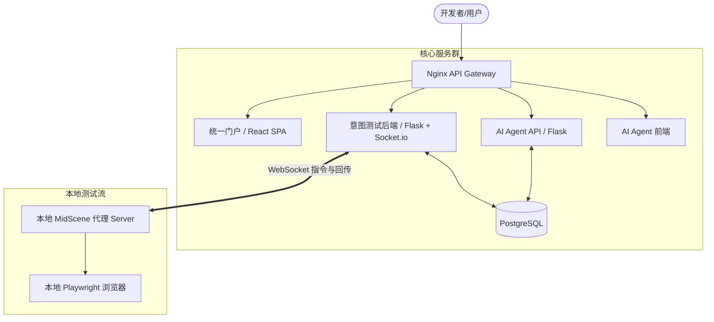

<div align="center">
  <h1>🤖 AI4SE (AI for Software Engineering)</h1>
  <p><strong>智能驱动、测试先行的模块化软件工程研发与协作平台</strong></p>

  <p>
    <a href="#项目概述">项目概述</a> •
    <a href="#核心模块与智能体">核心模块与智能体</a> •
    <a href="#系统架构">系统架构</a> •
    <a href="#快速开始">快速开始</a> •
    <a href="#开发与部署规范">开发与部署规范</a> •
    <a href="#扩展文档">扩展文档</a>
  </p>
</div>

---

## 📖 项目概述

**AI4SE** 是一个实验性与工程化并重的融合型平台，旨在探索如何利用大语言模型（LLM）与自动化代理重塑软件工程的工作流。项目秉承 **Harness Engineering（约束工程）** 原则：通过约束和规范确保 AI 生成的代码与逻辑具有强一致性、高可测性以及良好的可观测性。

本项目提供了一套完整的“需求分析 -> 测试设计 -> 自动执行”流水线，以意图驱动的自动化测试和多个专业化 AI 智能体协同为核心能力，配合统一的开发门户管理所有进程。

---

## 🧩 核心模块与智能体

### 🤖 AI 智能体体系 (new-agents)
系统基于 LangGraph 和 LangChain 构建了多个具备专有职责的智能体，覆盖软件研发的不同阶段：
- **Alex (业务需求分析师)**: 协助用户快速梳理业务需求，进行需求拆解并自动生成标准化 PRD（产品需求文档）。
- **Lisa (测试工程专家)**: 深入执行测试策略设计、需求可测性评审与工作流支持，并支持输出具备高测试密度的检查与断言矩阵。

### 🧪 意图测试引擎 (intent-tester)
打破传统的强代码依赖自动化测试模式：
- **自然语言驱动**: 允许开发者或测试人员使用纯自然语言（意图）描述测试用例和步骤。
- **MidScene 代理服务器**: 结合 `MidSceneJS` 与 `Playwright`，在本地接收云端指令理解并自动驱动浏览器完成测试步骤。
- **实时同步**: WebSocket 全双工通信，可实时反馈运行节点、抓取 DOM 结构及执行截图。

### 🏠 统一开发门户 (frontend)
一个基于 React + Vite + Tailwind CSS 的现代化统一入口（SPA），囊括首页介绍、工具导航入口、智能体交互和个人工作流中心。

---

## 🏗️ 系统架构

本项目采用 **Modular Monorepo（模块化单体）** 架构模式。所有核心业务逻辑封装于独立模块中（如 `intent-tester` 等），既实现了代码共享，又保留了未来平滑拆分为微服务的可能。

### 整体拓扑



### 目录结构概览

```text
AI4SE/
├── scripts/               # 运维与自动化环境脚本（重点：部署与测试脚本）
├── tools/                 # 各独立模块
│   ├── new-agents/        # AI 智能体服务 (前后端分离架构)
│   ├── intent-tester/     # 意图测试工具 (Flask + 模板网页 + Node代理)
│   ├── frontend/          # 统一门户前端界面
│   └── shared/            # 跨模块共享工具（数据库配置、基础工具类等）
├── nginx/                 # Nginx 反向代理配置
├── AGENTS.md              # 智能体扩展与开发协议说明
└── docker-compose.*.yml   # Docker 环境编排
```

---

## 🚀 快速开始

### 运行环境配置
- [Docker & Docker Compose](https://www.docker.com/) (基础设施必需)
- Node.js 20+ (本地开发必需)
- Python 3.11+ (本地开发必需)

### 初始化与一键唤起

```bash
# 1. 检出并进入项目主目录
git clone https://github.com/pollyan/intent-test-framework.git
cd intent-test-framework

# 2. 准备配置及凭据
cp .env.example .env
# 编辑 .env 文件填入必需参数 (如 OPENAI_API_KEY)

# 3. 本地全量部署与启动
# 请务必使用提供的脚本进行 Docker 容器构建和部署
./scripts/dev/deploy-dev.sh
```

### 核心服务访问矩阵

启动完毕后，项目核心服务默认通过宿主机映射：
- **统一开发门户首页**: [http://localhost](http://localhost)
- **AI 智能体 (Alex/Lisa)**: [http://localhost/new-agents](http://localhost/new-agents)
- **意图驱动测试引擎**: [http://localhost/intent-tester](http://localhost/intent-tester)

*(注：自动化测试执行依赖本地挂载的 MidScene Proxy，在 `tools/intent-tester/browser-automation/` 下独立存在，默认在 `3001` 端口通讯)*

---

## 👨‍💻 开发与部署规范

为了维护模块化单体的清晰度与系统的灵健硕性，请严格遵守以下开发契约：

1. **环境与部署的一致性约束**
   - 所有的启动、更新和构建（本地与开发环境）**必须**使用 `scripts/dev/deploy-dev.sh` 脚本驱动，严禁通过原生命令直接野蛮更新 docker-compose。
   - 所有云端环境发布**禁止直连服务器修改部署**，严格通过配置好的 GitHub Actions DevOps 流程触发自动部署流。
2. **SOLID 与 DRY 代码要求**
   - 通用的工具和类库应抽离到 `tools/shared/`，严禁在独立模块中重复造轮子。
   - 保证配置与代码分离，任何鉴权和动态路由不得硬编码，走环境变量和统一直出。
3. **AI 智能逻辑开发底线**
   - **禁止关键词硬生生匹配**：永远不要使用关键词过滤去模拟智能体的决策逻辑，必须根据上下文和语义构建合适的 Prompt，综合代理判断。
   - **原子化变更与测试同行**：遵循 TDD 并保持小步提交。代码变更后请第一时间利用自动化意图测试环境进行回归验收验证。

---

## 📚 扩展文档与接口

项目中散落的技术细节和内部契约已被提炼到如下文档集中：

- **智能体生态**: [AGENTS.md](./AGENTS.md) 
- **API 约定契约**: [docs/api-contracts.md](./docs/api-contracts.md) 
- **源代码结构分析**: [docs/source-tree-analysis.md](./docs/source-tree-analysis.md)
- **数据模型规约**: [docs/data-models.md](./docs/data-models.md)

---

<div align="center">
  <p>🛠️ Powered by AI & Developed with TDD loop. 🛠️</p>
</div>
