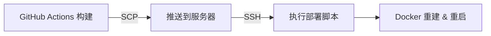

# MidScene本地客户端配置

## 架构说明

```
┌─────────────────┐
│   云服务器       │
│  2核4G 60G      │
├─────────────────┤
│ Flask Web应用   │ ← 用户管理、用例管理、报告展示
│ PostgreSQL     │ ← 数据存储
│ Nginx          │ ← 反向代理
└─────────────────┘
        ↑
        │ HTTP API调用
        │
┌───────┴─────────┐
│  本地客户端      │
│ (测试执行机)     │
├─────────────────┤
│ MidScene Server │ ← 启动浏览器、执行测试
│ Playwright      │ ← 浏览器自动化
└─────────────────┘
```

## 为什么这样设计？

### MidScene Server为什么在客户端？

1. **需要图形环境**
   - Playwright需要启动真实浏览器
   - 浏览器需要渲染页面、执行JavaScript
   - 云服务器通常没有图形界面

2. **资源消耗大**
   - 浏览器内存占用高（可能几百MB到几GB）
   - CPU消耗大（页面渲染、JS执行）
   - 2核4G服务器资源有限

3. **测试场景灵活**
   - 可以在不同机器上运行测试
   - 支持并发执行（多台客户端）
   - 可以测试本地开发的网站

4. **安全性**
   - 测试时访问的目标网站可能在内网
   - 浏览器可以访问localhost
   - 不需要暴露测试环境到公网

## 部署方案

### 云服务器部署 (GitHub Actions + SCP Push)

采用 **GitHub Actions + SCP 推送模式**，完全规避服务器访问 GitHub 的网络问题。



1. **GitHub 端构建**：
   - 运行自动化测试
   - 打包应用代码（排除 git、node_modules 等）

2. **推送部署**：
   - 通过 SCP 将部署包推送到服务器临时目录
   - SSH 执行 `scripts/deploy-from-upload.sh`

3. **服务器端执行**：
   - 备份当前版本
   - 应用新代码
   - 重建 Docker 镜像
   - 重启服务并进行健康检查
   - 失败自动回滚

**服务器只运行**：
- Flask Web应用（端口5001）
- PostgreSQL数据库（端口5432）
- Nginx（端口80/443）

**云服务器只运行**：
- Flask Web应用（端口5001）
- PostgreSQL数据库（端口5432）
- Nginx（端口80/443）

### 本地客户端部署

#### 方式1：直接运行（推荐）

```bash
# 1. 安装依赖
npm install

# 2. 配置环境变量
cp .env.example .env
nano .env

# 填入配置：
# OPENAI_API_KEY=your-key
# OPENAI_BASE_URL=https://dashscope.aliyuncs.com/compatible-mode/v1
# MIDSCENE_MODEL_NAME=qwen-vl-max-latest
# MAIN_APP_URL=https://your-server.com/api  # 云服务器地址

# 3. 启动MidScene服务
node midscene_server.js
```

#### 方式2：使用Docker（可选）

```bash
# 只启动MidScene服务
docker-compose up midscene-server
```

## 使用流程

### 1. 创建测试用例（云服务器Web界面）

访问: `https://your-server.com`
- 创建测试用例
- 编辑测试步骤
- 配置测试参数

### 2. 执行测试（本地客户端）

**方式A：通过Web界面触发**
1. 在Web界面选择测试用例
2. 点击"执行"
3. Web应用通过WebSocket连接本地MidScene服务
4. MidScene在本地启动浏览器执行测试
5. 结果回传到云服务器

**方式B：本地直接执行**
```python
from midscene_python import MidSceneAI

# 连接本地MidScene服务
ai = MidSceneAI(server_url="http://localhost:3001")

# 执行测试
ai.goto("https://example.com")
ai.ai_tap("登录按钮")
ai.ai_input("用户名", "username")
# ...
```

### 3. 查看报告（云服务器Web界面）

访问: `https://your-server.com/reports`
- 查看执行历史
- 查看截图
- 分析测试结果

## 网络配置

### 如果MidScene需要访问云服务器API

在本地 `.env` 配置：
```env
MAIN_APP_URL=https://your-server.com/api
```

### 如果云服务器需要触发本地MidScene

有几种方案：

**方案1：内网穿透（推荐开发测试）**
```bash
# 使用ngrok或frp暴露本地3001端口
ngrok http 3001
# 得到公网URL: https://abc123.ngrok.io
```

然后在云服务器环境变量配置：
```env
MIDSCENE_SERVER_URL=https://abc123.ngrok.io
```

**方案2：VPN或专线（推荐生产）**
- 本地机器和云服务器建立VPN连接
- 云服务器可以通过VPN内网IP访问本地MidScene

**方案3：轮询模式（最简单）**
- 本地MidScene定期请求云服务器
- 获取待执行的测试任务
- 执行后上报结果

## 推荐配置

### 云服务器（2核4G）资源分配
```yaml
- Flask应用: 1.5GB内存, 1.5核CPU
- PostgreSQL: 512MB内存, 0.5核CPU
- Nginx: 256MB内存, 0.5核CPU
- 系统预留: 约1.5GB
```

### 本地客户端最低要求
- CPU: 2核
- 内存: 4GB（浏览器+MidScene）
- 网络: 稳定的互联网连接

## 小结

✅ **云服务器**：轻量级，只负责Web界面和数据存储
✅ **本地客户端**：重量级，负责浏览器自动化和测试执行
✅ **资源优化**：2核4G服务器完全够用
✅ **灵活性高**：可以多台机器并行执行测试

这样的架构既节省云服务器资源，又保证测试执行的灵活性！
