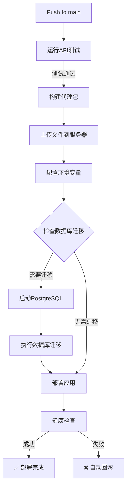

# GitHub Actions 自动化部署指南

## 前提条件

### 必需的GitHub Secrets

在GitHub仓库中配置以下Secrets（Settings → Secrets and variables → Actions）：

| Secret名称 | 用途 | 值 | 状态 |
|-----------|------|-----|------|
| `SERVER_HOST` | 腾讯云服务器IP地址 | 例: `43.xxx.xxx.xxx` | ✅ 已配置 |
| `SERVER_USER` | SSH登录用户名 | 例: `root` 或 `ubuntu` | ✅ 已配置 |
| `SSH_PRIVATE_KEY` | SSH私钥（完整内容） | `-----BEGIN ... KEY-----` | ✅ 已配置 |
| `DB_PASSWORD` | PostgreSQL数据库密码 | **见下方** | ⚠️ 待配置 |
| `SECRET_KEY` | Flask应用密钥 | **见下方** | ⚠️ 待配置 |

### 需要配置的新Secrets

#### DB_PASSWORD
```
25SOKWc5EL50HO8Xn3JZosWTUpYl2bJRUYHp5l8+LcE=
```

#### SECRET_KEY
```
X8R8512kefIpcM8J1HCgMAqCVwdbtQ1nD+Dks9j8r9Rk1WpQ+rGo72ZNFDc2XoIR
```

## 自动化部署流程

### 触发方式

部署会在以下情况自动触发：
- ✅ 推送代码到 `main` 或 `master` 分支
- ✅ 合并Pull Request到主分支

### 完整流程



### 部署步骤详解

#### 1. API测试 (自动)
- 运行单元测试和API集成测试
- 测试失败会阻止部署

#### 2. 环境配置 (自动)
- 创建或更新`.env`文件
- 使用GitHub Secrets配置数据库密码和应用密钥

#### 3. 数据库迁移检测 (自动)
**检测逻辑**:
- 检查是否存在旧的`langfuse-postgres-1`容器
- 检查是否已存在新的`intent-test-db-prod`容器
- 决定是否需要执行迁移

**迁移场景**:
- ✅ **首次部署**: 直接创建新数据库，无需迁移
- ✅ **从旧版本升级**: 自动迁移数据到新容器
- ✅ **已迁移**: 跳过迁移步骤

#### 4. 数据迁移执行 (自动，如需要)
- 启动新的PostgreSQL容器
- 从旧容器导出数据
- 导入到新容器
- 验证数据完整性

#### 5. 应用部署 (自动)
- 构建Docker镜像
- 启动所有服务（web-app, postgres, nginx）
- 执行健康检查

#### 6. 验证与回滚 (自动)
- 健康检查通过 → 部署成功
- 健康检查失败 → 自动回滚到上一版本

## 首次部署

### 推荐流程

**建议在低峰期进行首次部署，因为数据迁移会导致短暂服务中断。**

#### 步骤1: 配置GitHub Secrets
1. 添加 `DB_PASSWORD` 和 `SECRET_KEY`（见上方值）
2. 验证其他Secrets已正确配置

#### 步骤2: 提交代码触发部署
```bash
git add .
git commit -m "feat: 部署独立PostgreSQL数据库"
git push origin main
```

#### 步骤3: 监控部署过程
1. 访问GitHub仓库 → **Actions**标签
2. 查看最新的workflow运行
3. 展开 "Deploy on Server" 步骤查看详细日志

#### 步骤4: 验证部署结果
```bash
# SSH连接服务器
ssh $SERVER_USER@$SERVER_HOST

# 检查容器状态
cd /opt/intent-test-framework
sudo docker-compose -f docker-compose.prod.yml ps

# 检查数据库
docker exec -it intent-test-db-prod psql -U intent_user -d intent_test -c "\dt"

# 检查Web应用
curl http://localhost:5001/health
```

## 日常部署

### 正常代码更新
推送代码到主分支即可自动部署，无需手动干预：

```bash
git add .
git commit -m "feat: 添加新功能"
git push origin main
```

### 监控部署状态

#### GitHub Actions界面
访问: `https://github.com/pollyan/intent-test-framework/actions`

**状态指示**:
- 🟡 黄色 - 部署进行中
- 🟢 绿色 - 部署成功
- 🔴 红色 - 部署失败

#### 查看详细日志
1. 点击具体的workflow运行
2. 展开各个步骤查看日志
3. 数据库迁移日志在 "Database Migration" 组中

## 故障排除

### 部署失败：数据库迁移错误

**错误信息**: `❌ 数据库迁移失败`

**解决方法**:
1. 查看GitHub Actions日志中的详细错误
2. SSH登录服务器手动检查：
   ```bash
   cd /opt/intent-test-framework
   docker-compose -f docker-compose.prod.yml logs postgres
   ```
3. 如需手动迁移：
   ```bash
   chmod +x scripts/migrate_langfuse_to_local.sh
   ./scripts/migrate_langfuse_to_local.sh
   ```

### 部署失败：健康检查超时

**错误信息**: `❌ 健康检查失败`

**解决方法**:
1. 检查Web应用日志：
   ```bash
   sudo docker-compose -f docker-compose.prod.yml logs web-app
   ```
2. 检查数据库连接：
   ```bash
   docker exec -it intent-test-web env | grep DATABASE_URL
   ```
3. 系统会自动回滚到上一版本

### Secrets配置错误

**错误信息**: `.env`文件中密码或密钥为空

**解决方法**:
1. 验证GitHub Secrets配置正确
2. Secret名称大小写必须完全匹配
3. 重新运行workflow

## 高级配置

### 手动触发部署

如果需要在不推送代码的情况下重新部署：

1. 访问 Actions 标签
2. 选择 "Deploy to Tencent Cloud via SCP/SSH"
3. 点击 "Run workflow"（如已启用）

或通过命令行：
```bash
# 创建空提交触发部署
git commit --allow-empty -m "chore: 手动触发部署"
git push origin main
```

### 跳过CI（紧急情况）

如果需要直接SSH部署（不推荐）：

```bash
ssh $SERVER_USER@$SERVER_HOST
cd /opt/intent-test-framework
sudo bash scripts/deploy.sh production
```

## 安全建议

1. ✅ **定期轮换Secrets**: 每季度更换数据库密码和应用密钥
2. ✅ **限制SSH访问**: 使用防火墙限制GitHub Actions IP
3. ✅ **监控部署日志**: 定期检查是否有异常部署
4. ✅ **备份验证**: 确认数据库自动备份正常运行

## 相关文档

- [数据库迁移指南](../docs/database-migration-guide.md)
- [部署文档](../scripts/deployment/DEPLOYMENT.md)
- [Docker Compose配置](../docker-compose.prod.yml)
