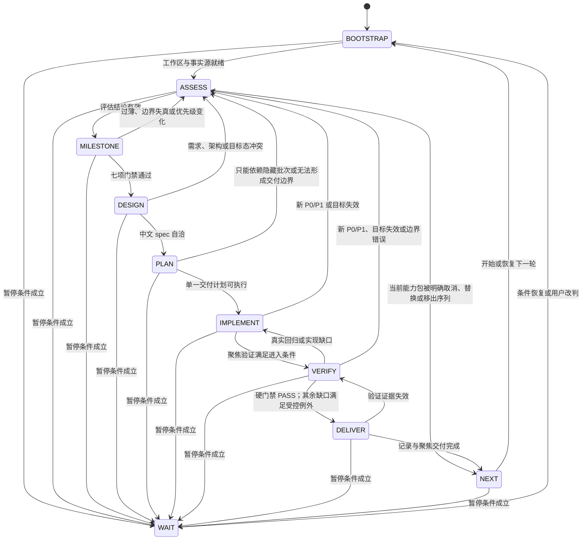

# AI4SE 目标模式运行手册

本文是 AI4SE 目标模式唯一稳定执行入口。它规定目标模式的状态、产物、门禁、失败路由、授权和交付边界；仓库结构、当前实现、测试命令与 CI 事实必须在运行时从稳定事实源读取，不在本文维护易漂移副本。

## 1. 目标模式契约

### 1.1 规范语义与运行不变量

- **必须**：硬门禁。未满足时不得进入下一状态，必须修复、改道或形成外部阻塞记录。
- **默认**：正常路径。只有出现本文定义的例外条件时才能偏离，并记录原因、风险和恢复条件。
- **允许**：授权边界内的可选行为，不构成完成要求。

进入目标模式后必须从 `BOOTSTRAP` 开始，按状态机转换；不得依赖对话记忆跳过评估、设计、计划、验证或交付门禁。每次转换必须能指出当前状态、必需产物、离开门禁和失败证据。`docs/strategy/goal-mode-playbook.md` 是目标模式规则的唯一入口；局部文档只能引用本文，不得复制通用执行规则。

每轮只推进一个用户可感知的完整能力包，或一个有独立价值的工程信任闭环。目标模式默认自主完成事实读取、评估、设计、计划、实现、验证、记录和聚焦交付，不把普通澄清或常规审批作为停顿点；使用合理假设时必须把依据和风险写入当轮产物。

### 1.2 事实源优先级

每轮必须读取当前文件和可执行事实，不得机械沿用上一轮结论。冲突按以下顺序裁决并留痕：

1. 用户最新明确的目标、纠错、授权和暂停要求优先于历史记录；但不能据此静默绕过仓库硬约束或扩大外部权限。
2. `AGENTS.md` 与本文定义仓库和目标模式硬约束，优先于普通 todo、spec、plan 和归档记录。
3. 当前代码、测试、配置、workflow、runner、package scripts 与实际失败证据优先于已经过期的说明。
4. `docs/index.md`、架构、API、测试、编码与设计规范等稳定文档承载领域事实；按本轮影响范围读取。
5. 活跃 todo、专项计划、当轮 spec 与 implementation plan 承载局部目标和执行决定；历史文件只作为证据来源。

发现冲突时不得静默选边，必须在评估、spec、plan 或交付说明中写明冲突、裁决和后续处理。

无论用户是否指定本轮目标，`BOOTSTRAP` 都必须扫描活跃 todo 的 P0/P1 和当前失败证据。未指定目标时，从活跃 todo、失败证据、专项计划和相关 backlog 聚合候选并执行完整 CGA；已指定目标时，同向、低冲突且可形成厚切片的高优先级项必须进入评估，未纳入本轮时记录原因和去向。

### 1.3 授权、工作区与暂停边界

目标模式允许在当前仓库内进行必要的读取、修改、验证、文档同步、精确 staging、聚焦 commit，以及满足第 6 节条件时的 push。它不授权回滚或覆盖用户改动、触碰无关路径、泄露凭证、伪造证据、绕过质量门或进行未获授权的外部状态变更。

只有以下情况允许暂停并进入 `WAIT`：

- 缺少必须的权限、凭证、额度、浏览器登录态、网络授权、外部服务或仓库访问。
- 用户明确要求暂停或等待。
- 用户目标、仓库硬约束和当前事实之间存在无法自行裁决的根本冲突。

用户要求只讨论、只读审查或不修改时，只收缩本轮允许动作，不自动进入 `WAIT`；只要所需产物能在该边界内完成，就继续相应状态并交付非写入结果。只有目标必须写入、只读边界内不存在可交付结果且需要用户扩大授权时，才记录冲突、所需授权和恢复触发器后进入 `WAIT`。

普通实现困难、可由事实源回答的歧义、测试失败、只读工作或可修复的风险不构成暂停理由。运行中收到用户纠错或补充时，必须在下一个安全检查点停止原路线，把反馈纳入 `ASSESS`；若不构成改道条件，也必须记录取舍理由。

### 1.4 文档与产物职责

| 产物 | 唯一职责 | 不应承载 |
| --- | --- | --- |
| `AGENTS.md` | 仓库级架构、编码、测试和提交硬约束 | 目标模式详细状态机 |
| 本 Playbook | 目标模式状态、门禁、授权、验证和交付规则 | 当前模块清单、具体测试命令、历史执行记录 |
| `docs/todos/*.md` | 需求或发现、目标态、稳定边界、能力包、依赖、状态和结果证据 | CGA、TDD、子智能体、提交规则、逐步 implementation plan、长命令输出 |
| 完整 CGA / 目标承接检查 | 当前事实、候选或既定目标有效性、排序与改道判断 | 具体实现设计 |
| 中文 spec | 当前厚切片的需求、方案、架构、数据流、失败路径与测试设计 | 多轮路线图和逐步实现命令 |
| 中文 implementation plan | 当前厚切片的实施步骤、TDD 或文档验证顺序、文件所有权与验证计划 | 其他厚切片的实现 |
| 验证记录 | 当前事实版本、实际命令、范围、结果、缺口与证据位置 | 未运行验证的成功声明 |
| 当前测试与 CI 事实源 | 测试分层、命令、阈值、外部质量门和远端 job 事实 | 通用目标模式状态机 |

长期 todo 只需稳定记录能力包承接的需求、目标态、边界、依赖和结果证据；执行时由本文重新检查当前事实并生成当轮 spec、plan 与验证记录。

目标模式产物默认使用中文；命令、路径、API、schema、类型名、包名、协议名和不可翻译的专有名词保留原文。

## 2. 执行状态机



第 1.3 节的暂停条件适用于每个状态；图中的“暂停条件成立”统一表示缺少必需外部条件、用户明确暂停，或出现无法自行裁决的根本冲突。以下各状态的失败路由列出本状态特有的修复或改道路径；暂停条件一旦成立，必须保存当前状态、未完成门禁和恢复触发器后进入 `WAIT`。

### 2.1 `BOOTSTRAP`

- **进入条件**：新目标模式、恢复既有目标模式，或上一能力包已经交付。
- **必需产物**：当前用户目标与最新反馈；当前分支和 `git status`；用户已有改动、可写与禁止触碰边界；实际读取的稳定事实源、活跃 todo、相关代码与测试；未关闭质量门、阻断测试、外部阻塞和遗留风险；子智能体能力与可并行事项判断。
- **离开门禁**：工作区可以安全承载本轮工作，事实源足以评估，所有未关闭阻断项均已进入评估输入。
- **失败路由**：外部条件缺失或根本冲突不可裁决时形成阻塞记录并进入 `WAIT`；其他事实缺口继续补充，不得跳过到实现。

### 2.2 `ASSESS`

- **进入条件**：`BOOTSTRAP` 完成，或后续状态发现目标、优先级、边界或质量门发生变化。
- **必需产物**：按第 3 节互斥选择一份完整 CGA 或目标承接检查，包含当前质量门、用户反馈、工作区、候选或既定目标、改道判断和子智能体决策；只有完整 CGA 必须包含未选候选去向。
- **离开门禁**：一个且仅一个当前能力包被推荐或继续承接，优先级、边界、依赖和可观察证据都有当前事实支持；或当前能力包被明确取消、替换或移出序列。
- **失败路由**：需要重排、拆并或修复风险时留在 `ASSESS`；外部条件缺失进入 `WAIT`；不得用旧计划强行继续。

### 2.3 `MILESTONE`

- **进入条件**：`ASSESS` 已选定或承接一个候选能力包。
- **必需产物**：从用户完整任务命名的厚切片，明确角色、真实场景和独立价值；纳入与排除边界、依赖、能力增量句、验收条件，以及第 3 节七项门禁结论。
- **离开门禁**：入口、动作、处理、可见结果、状态承接、失败反馈和证据全部成立，相邻必要缺口已合并，或工程信任闭环例外已被严格证明。
- **失败路由**：过薄、边界失真、无法形成独立价值或出现新优先级时回到 `ASSESS`；不得把半条动作链送入设计。

### 2.4 `DESIGN`

- **进入条件**：`MILESTONE` 的厚切片门禁通过。
- **必需产物**：按照第 4 节完成 brainstorming，并形成自洽的中文 spec，覆盖用户、输入、成功状态、失败路径、下游承接、非目标、方案比较、架构、组件、数据流、错误处理和测试设计。
- **离开门禁**：需求和架构边界清楚，所选方案及不选理由可审计，成功与失败证据可以被计划化。
- **失败路由**：需求、架构、事实或目标态无法自洽时回到 `ASSESS`；不得靠实现假设填补设计冲突。

### 2.5 `PLAN`

- **进入条件**：中文 spec 已完成且无未决设计冲突。
- **必需产物**：只覆盖当前厚切片的中文 implementation plan，明确 TDD 或文档验证路径、预计修改范围、文件所有权、子智能体边界、聚焦与跨层验证、全量与 CI 等价边界、聚焦提交和交付边界。
- **离开门禁**：计划可按小步执行并最终形成一个独立价值点，所有写入路径和验证责任有唯一归属。
- **失败路由**：只有多个隐藏内部批次完成后才首次产生价值，或无法形成单一交付边界时回到 `ASSESS` 重新划分。

### 2.6 `IMPLEMENT`

- **进入条件**：implementation plan 通过门禁且工作区写入边界安全。
- **必需产物**：行为变更的 RED/GREEN 证据或纯文档变更的一致性证据；计划内实现；主 Agent 对所有子智能体输出的 diff 与证据复核；必要的局部记录更新。
- **离开门禁**：计划内实现完成，最快的确定性聚焦验证满足预期，没有越界写入、silent fallback、伪造成功或未处理的实现缺口。
- **失败路由**：聚焦验证失败时留在 `IMPLEMENT`；新 P0/P1、目标失效或边界错误回到 `ASSESS`；外部实现条件缺失进入 `WAIT`。

### 2.7 `VERIFY`

- **进入条件**：`IMPLEMENT` 的聚焦验证已达到进入门槛，最终实现和必要文档已经落定。
- **必需产物**：第 5 节要求的聚焦、必要跨层、动态 CI 等价和完成型全量验证记录；证据分层；所有未运行、阻塞、超时或不稳定项；远端失败时的闭环记录。
- **离开门禁**：所有不可豁免关键质量门为 `PASS`；其余验证缺口如存在，必须满足第 5.1 节受控例外并保留原始非 `PASS` 状态、风险、范围与恢复条件。
- **失败路由**：真实回归、实现缺口、测试选择或 runner 缺陷造成的 `NOT_RUN`，以及确认可由实现或测试基础设施修复的 `TIMEOUT` / `FLAKY` 回到 `IMPLEMENT`；验证范围、目标或切片边界错误以及新 P0/P1 回到 `ASSESS`。根因未明的 `TIMEOUT` / `FLAKY` 先留在 `VERIFY` 诊断并保留首次证据；只有必需外部条件缺失才以 `BLOCKED` 记录并进入 `WAIT`。任何未满足离开门禁的结果都不得进入 `DELIVER`。

### 2.8 `DELIVER`

- **进入条件**：`VERIFY` 的不可豁免关键门禁全部通过；其余验证缺口如存在，必须满足第 5.1 节的受控例外。
- **必需产物**：稳定事实源和 todo 的必要更新；启动前用户已有 staged 项与本轮新增 staged 项的精确清单；聚焦 commit 或合法暂缓记录；push 决定；完整交付说明。
- **离开门禁**：本轮新增 staged 集只包含本轮文件且用户原有 staged 项保持原样；已形成一个对应完整能力包、工程信任闭环或 bugfix 的聚焦 commit，或符合第 6.2 节暂缓条件、记录完整且 index 状态符合用户明确安排；交付说明与当前 `HEAD`、远端和未提交 diff 一致。
- **失败路由**：证据失效回到 `VERIFY`；staging、记录或提交归属不清时留在 `DELIVER` 修正，不得带入下一轮。

### 2.9 `NEXT`

- **进入条件**：当前厚切片真正完成，或经 `ASSESS` 明确取消、替换或移出当前序列。
- **必需产物**：已完成与剩余能力包清单、当前残余风险、下一候选来源；若报告百分比，同时给出能力包依据。
- **离开门禁**：当前轮没有被外部阻塞伪装成完成，下一轮必须重新读取当前事实。
- **失败路由**：发现当前厚切片未完成时回到 `BOOTSTRAP` 重建事实，再由 `ASSESS` 定位应恢复的状态并重新通过沿途门禁；外部阻塞进入 `WAIT`。不得从 `NEXT` 直接跳回实现或验证，也不得自动跳过当前能力包。

### 2.10 `WAIT`

- **进入条件**：出现第 1.3 节允许暂停的条件，或必需外部验证结果为 `BLOCKED`。
- **必需产物**：阻塞事实、受影响状态与质量门、已经完成的安全工作、风险、所需外部条件、责任方和明确恢复触发器。
- **离开门禁**：条件已恢复或用户已作出足以改变路线的明确决定。
- **失败路由**：条件未恢复时保持 `WAIT` 并刷新记录；恢复后只能回到 `BOOTSTRAP` 重建当前事实，不得从阻塞点越过门禁。

## 3. 评估与厚切片契约

### 3.1 完整 CGA 与目标承接检查

`ASSESS` 必须且只能选择一种评估方式：

- **完整 CGA**：暂停条件不成立时，除非目标承接检查的全部前置条件能被当前证据同时证明，否则一律执行完整 CGA。包括用户未确认能力包序列或验收边界；开始新目标；事实或优先级发生足以影响顺序、边界或验收的实质变化；候选需要重排；边界需要拆分或合并；无法定位上一轮证据；或者出现任一强制改道条件。
- **目标承接检查**：仅当以下条件全部成立时执行：用户已确认能力包顺序和验收边界；稳定记录能定位上一轮证据与当前既定下一项；当前事实仍支持该顺序、边界和验收；不存在任何强制改道或暂停条件。任一条件缺失、冲突或无法由当前证据证明，都不得使用承接检查。

完整 CGA 的紧凑必填 schema：

1. 实际读取的事实源、因无关未展开的事实源及原因、工作区快照，以及未关闭质量门和最新用户反馈。
2. todo、反馈、失败证据和技术缺口如何聚合为用户能力包或工程信任闭环。
3. 至少两个候选能力包；确实只有一个时说明其他缺口为何不能形成候选。
4. 每个候选的目标态、当前能力、缺口、价值、风险、依赖和可观察验证方式。
5. 排序理由、推荐项，以及每个未选候选去向。
6. 推荐厚切片的纳入/排除边界、七项门禁、验收证据和子智能体/旁路审查决策。

目标承接检查的紧凑必填 schema：

1. 已确认目标、顺序、来源、上一轮状态和证据位置。
2. 当前代码、测试、文档与工作区是否仍支持既定顺序。
3. 新 P0/P1、未关闭质量门、用户反馈、架构/安全/契约风险、外部阻塞和运行中断检查；引用过的 E2E、judge 或人工审查必须记录当前事实源规定的通过线、结果、失败维度和处理决定。
4. 当前厚切片的边界、依赖、七项门禁和验收证据是否仍成立。
5. 子智能体/旁路审查的可用性、派发范围、状态、降级或不派发理由。
6. 结论只能是继续承接、升级完整 CGA 或暂缓。

以下情况必须停止原路线并改道：用户新目标或纠错；新 P0/P1；阻断测试或生产阻断；未关闭或低于当前事实源通过线的质量门；架构、安全、契约、错误写入或证据失真风险；既定切片失效；需要拆并边界；工作区无法安全承载。可修复项升级为完整 CGA；外部条件缺失进入 `WAIT`。

### 3.2 优先级与候选成立条件

默认优先级依次为：用户最新明确目标；阻断主路径演示、使用或部署的 P0；会造成 silent fallback、协议混用、密钥泄露、错误写入或证据失真的风险；活跃 todo 中能提升系统可信度或后续评判质量的 P0；当前专项中可形成纵向切片的高优先级事项；提高后续迭代可信度的测试、验证和文档护栏；普通清理、性能优化与历史整理。用户已确认的能力包序列可由新事实重排，但必须说明原因与去向。

候选至少应交付一种独立价值：用户可直接使用的新能力或完整体验改进；打通断裂的主路径或跨模块链路；把只读能力升级为可操作、可保存、可恢复或可评判的闭环；把分散底层能力集成为可复用 API、页面或工作流；或消除会造成 silent fallback、安全风险、错误写入、证据失真或无法验证的工程阻断。

### 3.3 七项厚切片门禁

厚切片必须围绕一个完整用户任务命名，并同时回答：

1. **入口**：用户或调用方从哪里开始。
2. **动作**：用户或调用方完成什么真实动作。
3. **处理**：系统完成什么核心处理。
4. **可见结果**：用户能看到、调用方能读取或下游能消费什么结果。
5. **状态承接**：结果如何保存、恢复、继续消费、评判或形成后续证据。
6. **失败反馈**：失败时如何显式停止、解释原因并提供恢复路径。
7. **证据**：什么可观察验证覆盖入口、处理、结果和关键失败边界。

同一用户动作链的相邻缺口默认合并。只有不同用户目标、入口、角色、数据契约、下游依赖或显著不同风险面构成自然业务边界时才能拆分，并必须记录排除部分的去向。不同文件、组件、函数或测试不是拆分理由。

单字段、单 schema、单 endpoint、单 helper、单 parser 分支、单按钮、单 prompt、单测试、局部异常分支或半条动作链默认过薄。先扩大边界并入同一场景所需的契约、服务、状态、交互、错误处理、下游消费和验证；若扩大后跨越无关场景或显著增加破坏面，回到 `ASSESS` 改选或按自然边界拆分。仍无法形成真实能力包时暂缓，不得进入 spec 或 plan。

backlog 看似只剩一个局部点时，也必须判断它属于哪个完整能力包；不能独立成立就合并，已经失去用户价值就标记完成、降级或移出当前目标，不能用“最后一点”或进度百分比为薄切片辩护。

实现可以包含多个 RED/GREEN 小步、helper、测试或互不冲突的子智能体任务，但 spec、plan、验收、commit 和进度只以厚切片为单位，不设置隐藏内部批次。切片过大时必须在 `ASSESS` 拆成多个同级能力包，不能先交付半条链路。

底层工作只有在解除 silent fallback、安全风险、错误写入、证据失真或不可验证阻断，并为调用方、生产排障或后续目标模式提供可复用价值时，才可作为独立工程信任闭环。必须写明解除的阻断、受益方、后续依赖、独立证据，以及为什么不能与用户可见能力同轮交付；不能停在内部 helper。

## 4. 协作、设计与实现

### 4.1 单工作区与 dirty diff 保护

目标模式默认在当前单工作区串行集成，不自动为候选、子任务或 worker 创建 worktree。`BOOTSTRAP` 必须记录当前分支、状态、用户已有改动及 ownership；不得覆盖、回滚或批量格式化不属于本轮的文件。若必须触碰同一文件，先确定可保护的写入边界和冲突处理方式。

只有用户明确要求隔离，或当前工作区确实无法安全承载必要修改时，才允许使用 worktree，并记录原因、路径、分支、合流与清理计划；进入 `DELIVER` 前必须完成合流与清理，或明确记录继续保留的原因和责任。大 dirty diff 触发按自然边界复核和精确 staging，不使用固定行数或文件数替代价值与 ownership 判断。

### 4.2 主 Agent 与子智能体

主 Agent 始终负责选题、边界、最终决策、集成、diff 复核、验证、记录、commit、push 和完成声明。子智能体只在明确授权范围内读取、审查、验证或修改互不重叠文件；不得回滚他人改动，不得自行 commit 或 push，其成功结论不能替代主 Agent 的新鲜证据。

存在两个以上独立候选、多个事实源、跨 workflow 契约、质量证据审查、真实 UI 证据、大 dirty diff ownership 审查，或可由互不重叠文件所有权实现的任务时，且工具可用，必须实际尝试分发。多个 writer 的写入范围必须互不重叠；共享配置、全局状态和高冲突文件由主 Agent 统一接线。主 Agent 在子智能体运行时继续不重叠工作，不空等。

每轮评估或交付记录必须包含：工具可用性、可并行事项、agent id、任务与写入范围、状态、允许路径、禁止触碰的 dirty 文件、验证证据、降级或不派发理由。子智能体返回后，主 Agent 必须核对最终说明、工作区状态、允许路径 diff 和覆盖该改动的最小验证。

工具不可用、权限错误、stream 断开、超时或未返回、返回 `BLOCKED` 且无法缩小推进、writer 越过允许路径或缺少可核验证据，均属于分发失败；越界或无证据输出不得被集成或采信。第一次失败时，记录 agent id、目标和失败类型，并用更小、更具体、优先只读的任务重试一次；第二次失败后停止重试，由主 Agent 顺序完成并记录“子智能体环境降级”。writer 失败后不得假设留下了有效改动，必须重新检查工作区、允许路径和越界路径的 ownership 与 diff，不得借清理越界输出回滚用户改动。

### 4.3 Brainstorming、spec 与 plan

`MILESTONE` 通过后必须先执行当前 brainstorming 技能，再写中文 spec，最后写中文 implementation plan；技能的过程要求从其当前事实源读取，不在本文复制。目标模式已有自主执行授权时，常规澄清与方案审批由 Agent 基于仓库事实自问自答并留痕；外部授权或不可裁决冲突仍按 `WAIT` 处理。不得用一句“已思考”替代完整过程。

无论技能的过程结构如何演进，spec 至少记录：已探索的代码、文档、测试、git 状态和保护边界；用户、目标、输入、成功状态、约束、失败路径、下游承接和非目标；2–3 个方案、trade-off、推荐方案和不选理由；以及架构、组件、数据流、错误处理和测试设计。

缺少上述链路时不得进入 `PLAN`。implementation plan 只覆盖当前厚切片，按可验证小步定义 TDD 或文档一致性路径、文件 ownership、子智能体边界、验证层级和交付边界，不复制其他能力包或 Playbook 通用规则。

### 4.4 实现纪律

行为变更必须遵循 `AGENTS.md` 和当前 TDD 技能：先获得能证明目标行为缺失的失败证据，再做最小实现，通过后重构并保持验证绿色。纯文档变更使用文档一致性检查代替代码测试，并记录未运行代码测试的原因。无论哪种路径，都禁止 silent fallback、生产 mock、伪造 artifact、假成功响应或用兼容分支隐藏无效状态。

## 5. 验证、CI 与证据

### 5.1 风险递进验证

验证必须按风险递进，且后层不能替代前层：

1. 先运行最快的确定性聚焦验证，证明 RED/GREEN、文档契约或目标行为。
2. 触及共享运行时、跨层契约、持久化、生成产物、部署或用户主路径时，扩大到必要的组合验证。
3. 根据当前 diff、当前 workflow、runner、package scripts 和 `docs/TESTING.md` 建立动态 CI 等价映射，不复制历史命令矩阵。
4. 完成型代码厚切片在最终代码与文档落定后、commit 前运行当前仓库规定的全量门禁；全量验证不能替代聚焦验证。纯文档或无代码变更可执行文档一致性检查并说明未跑代码测试的原因。
5. 真实浏览器、外部服务、模型或 LLM judge 只在当前事实源要求且条件可用时执行；不可用时按实际情况记录，不能用低层证据代替。

如果全量 runner 未让严重 lint、测试、构建或 E2E 失败以失败退出，必须修正 runner，或额外运行能暴露该风险的直接验证并记录原因。关键验证失败、未运行或 CI 等价性不可判断时默认不得 push；完成型 commit 必须等待所有不可豁免关键门禁通过，其余验证缺口只有满足下述受控例外才能进入交付。

“用户接受例外”不能把非 `PASS` 改写成 `PASS`，也不能把部分验证描述成完整验证。它只适用于 owning 事实源未标记为 blocking / must-pass 的非硬性证据缺口，且状态只能是可准确界定影响面的 `NOT_RUN`、`BLOCKED` 或 `TIMEOUT`；用户必须明确接受其范围、风险和恢复条件。`FAIL`、`FLAKY`、本应收集却零收集的测试、`AGENTS.md` 硬约束、安全 / 隐私 / 数据完整性、契约一致性、阻断测试，以及 owning 事实源规定的必需质量门均不可豁免。

文档一致性检查至少确认：面向当前或未来执行的路径、链接和引用存在；历史执行快照可以保留对已退役文件的事实性引用，但必须能从日期、归档位置或上下文识别为历史证据，且不得再被当作执行入口；没有未解释的待定项或占位；不与 `AGENTS.md`、稳定文档和当前代码事实冲突；新增执行规则有明确读取入口；`git diff --check` 通过。

### 5.2 质量门结果

| 状态 | 精确定义 |
| --- | --- |
| `PASS` | 目标验证被实际收集并执行，且满足当前事实源规定的通过条件。 |
| `FAIL` | 验证执行完成但未满足通过条件。 |
| `NOT_RUN` | 没有运行、未收集到目标测试，或被条件跳过。 |
| `BLOCKED` | 缺少权限、凭证、额度、外部服务或必要环境。 |
| `TIMEOUT` | 超过预先明确的时间边界，未得到有效通过结果。 |
| `FLAKY` | 同一事实版本在实现未变化时出现不一致结果。 |

`NOT_RUN`、`BLOCKED`、`TIMEOUT` 和 `FLAKY` 均不得冒充 `PASS`。skip、零收集、缺依赖或超时也不是通过。验证失败必须保留首个真实错误和首次失败证据；重跑只用于诊断，不得用 retry-to-green 覆盖首次失败或声称稳定通过。

当当前事实源要求 LLM judge 或其他评分门时，使用其中当前通过线。低于通过线记为 `FAIL` 并成为当前 P0 改道条件；必须记录失败维度、期望与实际产物差距、修复位置、重跑方式和新结果或阻塞原因。确定性回归通过不能替代尚未通过的质量门。

### 5.3 证据分层

验证记录必须明确区分以下证据层级：

1. 确定性单元、静态或契约验证。
2. 真实 UI 加 mock backend。
3. 真实前后端加 fake 外部依赖。
4. 真实外部服务、真实模型或 judge。

低层证据不得宣称覆盖高层行为。使用 mock、fake、录制数据或确定性替身时，必须写清它证明和未证明的范围；真实 UI、真实集成与真实外部质量门各自独立记账。

### 5.4 CI 等价与远端失败闭环

每轮 commit 或 push 前必须按当前 diff 映射可能触发的远端 CI 或等价风险面。最小 CI 等价记录字段为：风险面或远端 job、实际本地等价命令、结果状态、未覆盖原因、对应证据位置和交付决定。没有本地等价时必须说明环境或能力缺口，以及为什么允许或不允许继续。

聚焦验证只能覆盖其明确影响面；共享 API、SSE、持久化、workflow manifest、主路径、生成产物或部署变更不得只用单个局部测试宣称 CI 等价。应从当前 workflow、runner 和 package scripts 选择最接近的跨层组合，而不是依赖本文中的固定 job 名或命令。

远端 CI 失败必须成为当前“复现与防复发工程信任闭环”阻断项，闭环前不得继续或交付无关新功能。若同时出现另一个更高优先级的阻断或恢复工作，用户可以重排这些阻断项之间的顺序，但不能把远端失败降级为普通残余风险。记录并依次完成：失败 job、失败命令、对应事实版本及日志中的首个真实错误；与提交前本地证据比较；将根因分类为漏跑、环境、依赖、外部服务、时序、生成产物、真实回归或 CI 配置；在本地补复现；修实现、验证入口或事实源；加入防复发证据；运行覆盖该 job 的本地等价验证；最后重跑远端 CI。不得把远端 CI 当作首次验证渠道。

## 6. 记录与交付

### 6.1 稳定记录更新

只按实际变化更新稳定事实源。需求、目标态、能力包、依赖、状态和结果证据进入相关 todo；架构、API、测试、部署或工作流事实发生变化时更新其 owning 文档。CGA、spec、plan 和长命令输出不复制进长期 todo；通用规则只引用本文。决定不更新看似相关的稳定文档时，在交付说明中记录理由。

验证记录必须绑定当前事实版本，列出实际命令、范围、状态、未覆盖项和证据位置。未运行项必须显式列出，不能用概括性“验证通过”隐藏。

### 6.2 Staging、commit 与 push

交付前必须检查当前分支、未暂存与已暂存 diff 的 ownership，并区分启动前用户已有 staged 项与本轮新增 staged 项；精确 stage 本轮路径且不得改写用户原有 index 状态。无关用户改动、生成包、缓存、结果文件和未确认删除不得进入本轮新增 staged 集；无关 dirty diff 本身不是暂缓交付的理由，只要本轮改动能够安全拆分。若无法安全拆分，记录冲突、风险和恢复条件。

目标模式默认在一个完整能力包、工程信任闭环或 bugfix 通过验证后形成一个聚焦 commit。子智能体不得 commit；主 Agent 在复核最终 diff、验证和 staged 文件清单后提交。不得把多个独立价值点长期堆积为隐藏批次，也不使用固定 diff 行数或文件数决定提交边界；边界由可独立说明、验证和回滚的价值决定。

远端可用、分支允许且没有暂缓条件时，commit 后默认及时 push。只有用户明确要求不提交或不推送、仍是临时探索、关键验证未完成、风险未裁决、无法从 dirty diff 安全拆分、远端权限/凭证/网络或必需外部服务不可用时才可暂缓，并必须写明原因、风险和下一触发条件。已知关键门禁缺失或失败时不得默认 push。

### 6.3 完成说明与进度

完成说明至少包含：

- 交付的完整能力或工程信任闭环及其边界。
- 每项实际验证的命令、范围和 `PASS`/其他状态，以及未运行项和原因。
- 被要求或引用的 judge、E2E 与人工审查的通过线、实际结果、失败维度和处理决定。
- CI 等价判断：本地为什么能或不能挡住相关远端失败。
- 子智能体的 id、范围、结果、主 Agent 复核和降级情况，或不派发理由。
- 稳定事实源与 todo 更新、残余风险和恢复条件。
- commit/push 状态、最新 commit、当前 `HEAD`、与远端分支的同步判断。
- 当前未提交 diff 的归属，明确哪些是用户或其他任务改动且未被 stage。

进度按剩余用户可感知能力包、主路径闭环和工程信任闭环计算，不按文件、测试、commit 或微任务数量计算。若报告百分比，必须同时列出已完成、剩余和当前下一能力包；高百分比也不能省略剩余能力包。已经确认的能力包可因新事实重新排序、合并或暂缓，但不得拆回字段、按钮或单端点来制造进度。

需要创建 PR 时，描述遵循 `AGENTS.md`，并包含能力包边界、影响范围、实际验证、CI 等价判断和 UI 改动证据（如适用）。

进入 `NEXT` 后必须重新从 `BOOTSTRAP` 读取当前事实；只有已完成或经评估明确取消、替换、移出的能力包才能离开当前轮，外部阻塞只进入 `WAIT`。

## 7. 最小启动提示词

```text
请按照 `AGENTS.md` 和 `docs/strategy/goal-mode-playbook.md` 进入 AI4SE 目标模式。
本轮目标：<目标；未指定时从活跃 todo、失败证据和当前代码事实中选择>。
请保护当前工作区中的用户改动，按 Playbook 完成评估、单一厚切片、设计、计划、实现、验证和交付。
只有外部权限、凭证、服务或不可裁决冲突阻塞时才暂停；其余情况自主推进，并在关键状态转换时简短汇报。
```
