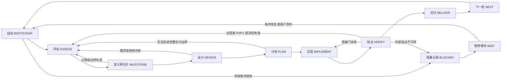

# 目标模式 Playbook 契约化状态机重构设计

- 日期：2026-07-10
- 状态：已实施并通过独立复核
- 范围：`docs/strategy/goal-mode-playbook.md`、`docs/strategy/goal-mode-cga-template.md`、`docs/strategy/goal-mode-ci-verification.md`
- 目标：在不降低目标模式执行效果的前提下，把三份重复、易漂移的规则文档重构为一份以状态转换和硬门禁为核心的 Playbook，并通过规则迁移审计与行为探针证明执行效果不退化。
- 实施记录：`584ea756`（设计）、`54fbc39f`（计划）、`0a8ac492`（主体重写）、`bd3c1217`（审查加固）、`e5c13f08`（附录退役）。最终规范只以 `docs/strategy/goal-mode-playbook.md` 为准；本设计保留批准时的决策基线。
- 审查后加固：只读任务不再误入 `WAIT`；完整 CGA 成为承接条件不足时的封闭兜底；非 `PASS` 结果、预先 staged 用户改动、子智能体越界 / 未返回和远端 CI 恢复均获得明确路由；“用户接受例外”被收窄为不可豁免硬门禁之外、可准确界定的非硬性证据缺口。
- 验证边界：规则迁移账本完成，12 个文本行为探针通过，两轮独立规则复审和整条提交链审查无 Critical / Important；业务代码测试、浏览器、外部服务和 LLM 质量门因纯文档治理范围而 `NOT_RUN`。

## 1. 背景与问题

当前目标模式由一份主 Playbook 和两份附录共同定义，合计约 700 行：

- `goal-mode-playbook.md` 同时承担定位、授权、启动、CGA、厚切片、子智能体、验证、提交和启动提示词。
- `goal-mode-cga-template.md` 再次定义 CGA、承接检查、厚切片、过薄示例和进度口径。
- `goal-mode-ci-verification.md` 维护验证命令、CI 等价映射、收尾表和远端失败复盘。

问题不只是篇幅，而是规则按主题和历史增量分散，造成以下结构性缺陷：

1. 同一规则在主循环、CGA、验证、提交和提示词中重复出现，修改时容易漂移。
2. 原则、强制字段、填空模板、当前命令和历史经验混在一起，Agent 难以判断哪些是硬门禁。
3. 执行过程缺少显式状态转换；失败后应该停留、回退、改道还是继续，依赖长篇文字推断。
4. `docs/todos/` 容易重复 Playbook 的 CGA、TDD、验证和提交规则，长期目标态文件因此膨胀成执行日志。
5. CI 附录中的具体命令容易落后于当前 workflow、package scripts 和测试配置。

本次不以压缩到某个行数为成功标准。真正目标是提高规则密度、执行确定性、恢复能力和维护一致性。

## 2. 目标与非目标

### 2.1 目标

- 保留 `docs/strategy/goal-mode-playbook.md` 作为目标模式唯一稳定入口。
- 把目标模式重构为明确的执行状态机，每个状态定义进入条件、必需产物、离开门禁和失败路由。
- 为硬规则建立清晰语义：必须、默认、允许。
- 保留完整 CGA、目标承接检查、厚切片、改道、验证、CI 等价、子智能体和交付边界的强制 schema。
- 明确长期 todo、CGA、spec、plan、验证证据和稳定事实源的职责，防止局部文档复制通用规则。
- 运行时读取当前 `AGENTS.md`、`docs/TESTING.md`、package scripts 和 CI workflow，不在 Playbook 复制易漂移命令。
- 通过规则迁移账本、行为探针和独立复核证明新 Playbook 没有丢失关键执行效果。
- 在新 Playbook 验证通过后删除两个附录，并只修复面向未来执行的引用。

### 2.2 非目标

- 不修改业务代码、测试实现、CI workflow 或测试 runner。
- 不引入 YAML、JSON schema、数据库或新的运行时解析器来执行 Playbook。
- 不以行数、文件数或字符数作为验收门槛。
- 不重写历史 spec、plan、归档 todo 或过去事实源快照中的旧文件引用。
- 不在本轮顺带整改当前测试策略、CI 假绿、健康检查或部署问题；这些内容在 Playbook 重构完成后继续由测试质量扫描提示词处理。
- 不把 Superpowers 技能正文复制进 Playbook；只声明目标模式如何调用和承接其产物。

## 3. 方案比较

### 3.1 方案 A：原结构去重

保留现有章节和两个附录，只删除重复段落。

- 优点：迁移风险最低。
- 缺点：规则仍按主题分散，未来仍会重复增长；失败路由和执行状态继续隐含在长篇 prose 中。

### 3.2 方案 B：契约化状态机单文件

保留一个 Playbook，把所有目标模式规则按执行状态和横切门禁重新组织；删除模板型附录和命令矩阵。

- 优点：Agent 能明确判断当前状态、下一步、必需产物和阻断条件；每条规则只有一个归属；恢复目标模式更稳定。
- 缺点：不是机械合并，需要完整规则迁移审计和场景验证。

### 3.3 方案 C：文档加机器可读配置

把状态机、门禁和产物 schema 放入 YAML，再由 Markdown 解释。

- 优点：可机械校验。
- 缺点：引入第二事实源、schema 和工具链，增加维护面；当前没有足够收益证明其必要性。

### 3.4 选择

采用方案 B。方案 A 无法解决重复产生机制，方案 C 对当前需求过度设计。方案 B 以执行效果为中心，同时保持单文件、可阅读和可维护。

## 4. 规则语义

新 Playbook 使用三级规范语义：

- **必须**：硬门禁。未满足时不得进入下一状态；必须修复、改道或记录外部阻塞。
- **默认**：正常路径。只有出现明确例外条件时才能偏离，并记录原因和风险。
- **允许**：边界内可选行为，不构成完成要求。

质量门结果统一使用以下状态：

- `PASS`：验证实际被收集并执行，且满足通过条件。
- `FAIL`：执行完成但未满足条件。
- `NOT_RUN`：没有运行、没有收集到目标测试或被条件跳过。
- `BLOCKED`：缺少权限、凭证、额度、外部服务或必要环境。
- `TIMEOUT`：超过明确时间边界。
- `FLAKY`：同一事实版本在未修改实现的情况下出现不一致结果；首次失败证据必须保留。

`NOT_RUN`、`BLOCKED`、`TIMEOUT` 和 `FLAKY` 都不能冒充 `PASS`。重跑只用于诊断，不得用 retry-to-green 抹除首次失败。

## 5. 文档和产物职责

| 产物 | 唯一职责 | 禁止承载 |
| --- | --- | --- |
| `AGENTS.md` | 仓库级架构、编码、测试和提交硬约束 | 目标模式详细状态机 |
| `goal-mode-playbook.md` | 目标模式状态、转换、门禁、授权与交付规则 | 当前模块清单、具体测试命令和历史记录 |
| `docs/todos/*.md` | 需求、目标态、稳定边界、厚切片、依赖、结果证据和状态 | CGA/TDD/子智能体/提交规则、implementation plan、长命令输出 |
| CGA 或承接检查 | 当前事实、候选或既定目标的有效性、改道判断 | 具体实现设计 |
| spec | 当前厚切片的需求、方案、架构、数据流、失败路径和测试设计 | 多轮路线图和逐步实现命令 |
| implementation plan | 当前厚切片的实施步骤、TDD 顺序、文件所有权和验证计划 | 其他厚切片的实现 |
| 验证记录 | 当前 `HEAD`、实际命令、范围、结果、缺口和证据位置 | 未运行验证的成功声明 |
| `docs/TESTING.md` 与当前 CI/package scripts | 当前测试分层、契约、命令和外部质量门事实 | 通用目标模式状态机 |

长期 todo 中的厚切片只需说明：承接的需求或发现、目标态、稳定边界、依赖关系和结果证据。执行时由 Playbook 重新检查当前事实并生成当轮 spec 与 plan。

## 6. 目标模式状态机



### 6.1 启动 `BOOTSTRAP`

进入条件：开始新目标模式、恢复既有目标模式，或上一厚切片已经交付。

必需产物：

- 当前用户目标和最新反馈。
- 当前分支、`git status`、用户已有改动和可写边界。
- 实际读取的稳定事实源、活跃 todo、相关代码与测试。
- 未关闭质量门、阻断测试、外部阻塞和上一轮遗留风险。
- 子智能体工具是否可用以及是否存在可并行只读工作。

离开门禁：工作区安全、事实源足够、未关闭阻断项已进入评估输入。

失败路由：缺权限、凭证或外部访问时形成 `BLOCKED` 记录并进入 `WAIT`；不可裁决的根本冲突才向用户请求方向。条件恢复或用户改判后重新进入 `BOOTSTRAP`，不得从阻塞点直接跳过门禁。

### 6.2 评估 `ASSESS`

评估必须二选一：

- **完整 CGA**：用户未确认目标序列，出现新目标、事实变化、候选需要重排、边界需要拆并，或存在改道条件。
- **目标承接检查**：用户已经确认厚切片顺序与验收边界，当前轮是既定下一项，且没有改道条件。

完整 CGA 最低 schema：

1. 当前事实和未关闭质量门。
2. 原始缺口如何聚合为能力包。
3. 至少两个候选能力包；确实只有一个时说明原因。
4. 排序理由和未选候选去向。
5. 推荐厚切片的边界、依赖和可观察验收证据。
6. 子智能体或旁路审查决策。

目标承接检查最低 schema：

1. 已确认目标、顺序和上一轮证据来源。
2. 当前代码、测试和工作区是否仍支持既定顺序。
3. 新 P0/P1、质量门、用户反馈、架构冲突和外部阻塞检查。
4. 当前厚切片的边界、依赖和验收是否仍成立。
5. 结论：继续承接、升级完整 CGA 或暂缓。

以下情况必须改道或升级完整 CGA：新 P0/P1、阻断测试、低于当前事实源通过线的质量门、用户纠错、架构/安全/契约风险、既定切片失效或工作区无法安全承载。

### 6.3 定义厚切片 `MILESTONE`

每轮只定义一个用户可感知的完整能力包，或一个有独立价值的工程信任闭环。

厚切片必须同时回答：

1. 入口：用户或调用方从哪里开始。
2. 动作：要完成什么真实动作。
3. 处理：系统完成什么核心处理。
4. 可见结果：用户或调用方获得什么结果。
5. 状态承接：结果如何保存、恢复、消费或形成证据。
6. 失败反馈：失败时如何显式停止、解释和恢复。
7. 证据：用什么可观察证据证明成功和关键失败边界。

同一用户动作链的相邻缺口默认合并；只能按不同用户目标、入口、角色、数据契约、下游或显著不同风险面拆分。单字段、单 helper、单 parser、单按钮、单测试或半条动作链默认过薄。

底层工程信任闭环只有在解除 silent fallback、安全风险、错误写入、证据失真或不可验证阻断，并为调用方或后续目标模式提供可复用价值时才能独立成立。

### 6.4 设计 `DESIGN`

使用 brainstorming 细化当前厚切片，并形成中文 spec。最低结果包括：

- 已探索的当前上下文和仍需保护的边界。
- 用户、输入、成功状态、失败路径、下游承接和非目标。
- 2–3 个方案、trade-off、推荐方案和不选理由。
- 架构、组件、数据流、错误处理和测试设计。

需求、架构或目标态无法自洽时回到 `ASSESS`，不得靠实现假设继续。

### 6.5 计划 `PLAN`

implementation plan 只覆盖当前厚切片，必须定义：

- TDD 或文档验证路径。
- 预计修改范围和文件所有权。
- 聚焦、跨层、全量和 CI 等价验证边界。
- 子智能体任务是否可独立、是否会写入冲突文件。
- 聚焦提交和交付边界。

如果计划只能依赖多个隐藏内部批次才能首次形成价值，或无法形成单一交付边界，回到 `ASSESS` 重新划分。

### 6.6 实现 `IMPLEMENT`

行为变更遵循 `AGENTS.md` 与当前 TDD 技能；纯文档变更执行文档一致性检查。默认单工作区串行集成，主 Agent 对最终决策、diff、验证和提交负责。

子智能体可以并行读取、审查、验证或修改互不重叠文件，但必须有明确范围，不得回滚他人改动，不得自行 commit/push。分发失败时缩小范围重试一次；再次失败后由主 Agent 顺序完成并记录降级。

实现未满足聚焦测试时保持在本状态，不得进入完成型验证。

### 6.7 验证 `VERIFY`

验证按风险递进：

1. 最快的确定性聚焦验证，证明 RED/GREEN 或目标行为。
2. 触及共享运行时、跨层契约、持久化或主路径时，扩大到必要组合验证。
3. 根据当前 diff、当前 workflow、runner 和 package scripts 建立 CI 等价映射。
4. 完成型代码厚切片在提交前运行当前仓库规定的全量门禁；全量验证不能替代聚焦验证。
5. 真实浏览器、外部服务、模型或 LLM judge 仅在事实源要求且条件可用时执行；不可用时记录 `NOT_RUN` 或 `BLOCKED`。

CI 等价记录至少包含：风险面或远端 job、本地等价验证、结果、未覆盖原因与交付决定。

证据必须区分：确定性单元/契约、真实 UI 加 mock backend、真实前后端加 fake 外部依赖、真实外部服务/模型/judge。低层证据不得冒充高层质量门。

验证失败时保留首个真实错误。真实回归回到 `IMPLEMENT`；新 P0/P1、目标失效或边界错误回到 `ASSESS`；外部条件缺失形成 `BLOCKED` 并进入 `WAIT`。远端 CI 失败必须进入“首错、比较本地验证、根因分类、本地复现、防复发、重跑”的闭环。

### 6.8 交付 `DELIVER`

交付前必须确认：

- 仅 stage 本轮相关文件，无关用户改动未被包含。
- 所有关键门禁处于 `PASS`，或例外已由用户明确接受并记录。
- 相关 todo 和稳定事实源已按实际变化更新。
- 一个 commit 对应一个完整能力包、工程信任闭环或 bugfix。

目标模式默认在验证通过后形成聚焦 commit，并在远端可用且没有暂缓条件时及时 push。暂缓必须写明原因、风险和恢复条件。

完成说明至少包含：交付能力、实际验证及状态、未运行项、CI 等价判断、子智能体与降级、残余风险、commit/push/HEAD/远端状态，以及未提交 diff 的归属。

### 6.9 下一轮 `NEXT`

只有当前厚切片真正完成，或经重新评估被明确取消、替换或移出当前序列后，才能进入下一轮。外部阻塞只进入 `WAIT`，不能自动跳过当前厚切片。进度按剩余用户能力包和工程信任闭环计算，不按文件、测试、commit 或微任务数量计算。

下一轮重新进入 `BOOTSTRAP`，基于当前事实做承接检查或完整 CGA，不依赖对话记忆机械继续。

## 7. 横切安全规则

### 7.1 事实与冲突

- 用户最新明确要求优先于历史文档。
- 当前代码和测试优先于过期说明。
- `AGENTS.md` 和 Playbook 优先于普通 todo、计划和归档记录。
- 冲突必须写入评估、spec、plan 或交付说明，不得静默选择。

### 7.2 工作区

- 启动时保护用户已有改动，不回滚、不覆盖、不批量格式化无关文件。
- 默认不创建新 worktree；只有用户明确要求或当前工作区无法安全承载时才允许，并记录合流和清理计划。
- 大 diff 触发自然边界复核，不使用固定行数或文件数代替价值判断。

### 7.3 提示词和局部文档

- 启动提示词只声明目标、授权和 Playbook 路径，不复制执行规则。
- todo、spec 和 plan 只记录本轮或本主题特有信息；通用规则引用 Playbook。
- 具体命令、模型配置、workflow stage、覆盖率阈值和测试矩阵从当前稳定事实源读取。

## 8. 新 Playbook 的最小启动提示词

```text
请按照 `AGENTS.md` 和 `docs/strategy/goal-mode-playbook.md` 进入 AI4SE 目标模式。
本轮目标：<目标；未指定时从活跃 todo、失败证据和当前代码事实中选择>。
请保护当前工作区中的用户改动，按 Playbook 完成评估、单一厚切片、设计、计划、实现、验证和交付。
只有外部权限、凭证、服务或不可裁决冲突阻塞时才暂停；其余情况自主推进，并在关键状态转换时简短汇报。
```

## 9. 迁移策略

迁移采用“先并行建设、再验证替换”的顺序：

1. 从三份旧文档提取规范性规则，建立临时规则迁移账本。
2. 按本设计从第一原则重写新 Playbook，不机械拼接旧段落。
3. 为每条旧规则记录新归属：保留、合并、由其他稳定事实源承载，或删除为纯重复/示例/易漂移副本。
4. 对新 Playbook 执行静态规则覆盖检查和行为探针。
5. 由独立 reviewer 检查丢失规则、矛盾、歧义和过度压缩。
6. 修复评审发现后，删除两个旧附录。
7. 只更新面向未来执行的活跃引用；历史事实源快照保持原样。
8. 再次检查失效链接、未来执行引用、文档格式和 git diff ownership。

迁移账本是实施期临时审查材料，不新增为长期事实源。若任一不可丢失规则没有新归属，或任一行为探针失败，旧附录不得删除。

## 10. 验证设计

### 10.1 静态验证

- 新 Playbook 只有一个规则入口，两个附录已删除。
- 所有面向未来执行的文档只引用新 Playbook。
- 每条旧规范性规则在迁移账本中有唯一处置。
- 没有 `TBD`、`TODO`、未解释占位或自相矛盾状态。
- `git diff --check` 通过。
- 文档路径和链接有效；历史快照中的旧路径只作为过去事实存在。

### 10.2 行为探针

至少验证以下场景：

1. 无指定目标时，Agent 比较至少两个能力包候选并交代未选项去向。
2. 已确认下一厚切片且事实未变时，Agent 使用承接检查而不是重新完整排序。
3. 已确认下一厚切片但出现阻断测试、当前质量门失败或用户纠错时，Agent 改道而不继续。
4. 输入单字段、单 parser、单按钮或单测试任务时，Agent 扩大为完整能力包、证明工程信任例外，或暂缓。
5. 工作区存在无关用户改动时，Agent 能识别、保护并只规划本轮写入边界。
6. 共享 API/SSE/持久化变更时，验证计划包含必要跨层组合和动态 CI 映射，而不是只跑单个测试。
7. 总脚本通过但存在未覆盖 CI 风险面时，Agent 不声明 CI 等价完成。
8. 测试被 skip、没有收集、超时或缺依赖时，Agent 不记为 `PASS`。
9. mock 浏览器 E2E 通过时，Agent 不声称真实前后端集成或真实模型质量通过。
10. 远端 CI 失败时，Agent 先比较本地证据、补复现和防复发，再继续新功能。
11. 子智能体越界修改、失败或未返回时，主 Agent 复核、降级并不采信无证据结论。
12. 当前厚切片未验证完成时，Agent 不进入提交和下一轮。

### 10.3 评审

独立 reviewer 必须检查：

- 状态机是否存在无法到达、无法退出或可绕过门禁的状态。
- CGA 与承接检查的选择条件是否互斥且完备。
- 改道条件是否覆盖用户纠错、质量门、架构、安全、契约和工作区风险。
- todo、spec、plan、验证证据的职责是否仍会互相复制。
- Playbook 是否包含易漂移的当前实现细节。
- 删除附录是否会让任何未来执行引用失效。

## 11. 验收标准

1. `goal-mode-playbook.md` 成为唯一面向未来执行的目标模式规则入口。
2. 新 Playbook 能通过规则迁移覆盖审计；没有不可丢失规则缺少新归属。
3. 新 Playbook 清楚定义状态、产物、离开门禁和失败路由，Agent 不需要从多处 prose 推断下一步。
4. 完整 CGA、承接检查、七项厚切片门禁、改道、子智能体、验证、CI 等价和交付边界均保留且无重复定义。
5. 长期 todo 只承载需求、目标态、边界、厚切片、依赖和结果证据。
6. 所有行为探针通过，独立 reviewer 未发现 P0/P1 执行退化。
7. 两个旧附录在上述条件满足后删除；面向未来执行的引用全部迁移到新 Playbook。
8. 历史记录中的旧附录路径不被篡改，并在交付说明中明确其历史性质。
9. 文档一致性、路径引用和 `git diff --check` 验证通过。
10. Playbook 重构完成后，恢复测试质量扫描提示词设计，不在本轮混入测试治理实现。
