# QG-022 可信生产发布事务与完整 Readiness 设计

- 关联待办：[QG-022](../../todos/2026-07-21-pre-push-full-validation-and-release-safety.md)
- 前置完成证据：[QG-021 验证记录](../../test_requirements/2026-07-21-qg021-validation-record.md)
- 设计日期：2026-07-21

## 厚切片身份基线

| 字段 | 固定内容 |
| --- | --- |
| 用户任务 | 让 protected GitHub SHA 的生产发布在构建失败不影响当前服务、切换失败可恢复经证明的 previous release，并只在真实主链路 readiness 成功后宣告成功。 |
| 能力包 | `QG-022 可信生产发布事务与完整 readiness`；不把 staging、rollback、health 或 CI 修改单独作为切片。 |
| 顺序 | 活动待办中 `QG-021` 已完成，`QG-022` 是唯一当前项。 |
| 成功证据 | release transaction 的故障 mutation、Docker 本地 release simulation、后端/网关 readiness contract、workflow 静态合同和当前 HEAD 的固定全量 pre-push PASS。 |
| 不变边界 | 不 push、不执行真实生产发布、不覆盖用户 JUnit 结果；不引入双栈 traffic shifting 或 LLM judge。 |

## 1. 用户目标与成功状态

用户要求的不是“脚本命令没有报错”，而是发布系统能够在真实失败中保持当前服务，或恢复已知的上一版本。成功时：

1. GitHub 将受保护 ref 的 `GITHUB_SHA` 和候选文件内容摘要写入 release manifest；远端只接受 manifest 与调用 SHA 完全匹配的包。
2. 候选在 `releases/<sha>/` 及私有 `.env` 中 materialize，构建、Compose config 和 image identity 预检均在 current 服务仍运行时完成。
3. 全局 lock 串行化 upload/activation；没有名称模式删除、无条件 `down` 或固定共享 upload temp。
4. 切换后，readiness 验证所有目标 Compose services、Nginx 到 New Agents frontend/upstream、New Agents DB readiness、SSE transport 和 PostgreSQL 临时读写；通过才以当前 SHA 为 active。
5. 任一步失败都把 `current` 指针、Compose deployment、image IDs 和 private env 引用恢复为 previous release，再跑同一 readiness；恢复不能被“命令返回 0”替代。

首次 adoption 若 current 不指向带 manifest/state 的可信 release，事务在切换前拒绝执行。这是刻意的 fail-closed migration：未知 live 目录不能被伪装成可回滚 SHA。运营者必须先以已知 SHA bootstrap trusted baseline；该步骤不由本次 GitHub job 猜测或伪造。

## 2. 现状与根因

`.github/workflows/deploy.yml` 在服务器先将固定 upload temp `rsync --delete` 到 `/opt/intent-test-framework`，再调用 `scripts/ci/deploy.sh production`。后者才把该目录备份，并在 build 前 `docker-compose down`、按名称模式清理容器/network。故 backup 已可能包含新文件，构建失败会造成先停机，两个 job 还会竞争 upload temp 与资源。

`scripts/health/health_check.sh` 的 `/health` 是 Nginx 固定 200；它遗漏 `/new-agents/` 页面，不验证 gateway 的 New Agents upstream/SSE，也不通过 New Agents backend 检查数据库。因而它不能为发布或 rollback 建立可信 readiness。

## 3. 方案与取舍

### 方案 A：修补当前 rsync + backup（不采用）

提前 copy current 虽可改善文件 rollback，但仍把 source、env、image 和 Compose identity 分散在可变目录中，无法证明恢复了同一 release；也不能阻止先停服务。

### 方案 B：Blue/green 双栈（不采用）

它可以把用户可见中断进一步压低，但需要独立 DB 写入、端口、Nginx traffic switch、state migration 与成本治理。当前单机单 Compose 的风险控制目标不要求引入这些新的可用性风险。

### 方案 C：不可变 release + 单项目受控切换（采用）

以 `releases/<40-char-sha>/`、`current` atomic symlink、私有 release env、source/config/image manifest 和一个 Compose project 表示身份。candidate 先 build/preflight；activation 时才将 `current` 交换并用 `docker compose up --no-build --wait --force-recreate` 受控重建。失败时以 previous release 的同一 Compose spec/image/env 重建并验证。它允许短暂、可观察的切换中断，但消除了无谓 build downtime 与伪 rollback。

## 4. 架构与数据流

```mermaid
flowchart LR
  A["GitHub protected SHA"] --> B["deploy-package + release-manifest"]
  B --> C["unique remote upload staging"]
  C --> D["release transaction lock"]
  D --> E["releases/SHA: immutable source + private env"]
  E --> F["build + compose config + image identity preflight"]
  F -->|"no current impact"| G["atomic current -> candidate"]
  G --> H["single Compose controlled recreate"]
  H --> I["gateway + page + DB + SSE readiness"]
  I -->|PASS| J["active release-state"]
  I -->|FAIL| K["atomic current -> previous"]
  K --> L["previous Compose + same readiness"]
```

### 4.1 Release identity 与文件布局

`scripts/ci/release_transaction.py` 是唯一线上 transaction owner。GitHub 在 package 内创建不含 secrets 的 `release-manifest.json`：`releaseId`（全长 SHA）、`sourceDigest`（排除 manifest 自身的确定性文件树摘要）和 schema version。远端重新计算摘要并拒绝不匹配的 upload。

远端布局：

- `<root>/uploads/<run-id>-<attempt>-<sha>/`：一次性接收目录，不能与其他运行共享；传输失败不会触碰 `current`。
- `<root>/releases/<sha>/`：不可变候选 source、由远端生成且 mode `0600` 的 `.env`、source/compose/config/image identity state。
- `<root>/current`：只指向经验证 active release 的原子 symlink。
- `<root>/.release.lock`：`flock` 独占锁；拿不到锁即失败，不取消已运行事务。

Release state 至少含 release SHA、source digest、compose config digest、每个 build service 的 image ID、private env 的 hash（不含值）以及 phase。previous state 必须同时通过 manifest、目录、private env 和 image ID 校验；否则 candidate 只能完成 prepare，不能切换。

### 4.2 Build、preflight 与受控切换

production Compose 的 build services 显式使用 `${AI4SE_RELEASE_ID}` 作为 image tag。transaction 使用 candidate directory 和 candidate `.env` 执行 `docker compose config`、`build`、image inspect；这些动作不停止、删除或重建 current containers。

准备成功后才执行：原子替换 `current` symlink、同一 project 的 `up --no-build --wait --force-recreate --remove-orphans`。只操作该项目，禁止按正则扫描/删除其他容器、network、image 或 upload。GitHub job 用 `concurrency`（`cancel-in-progress: false`）与远端 flock 双重互斥；前者序列化 workflow，后者保护手工和异常重试。

candidate readiness 失败、Compose 失败或 image identity 漂移时，transaction 把 `current` 原子换回 previous，再以 previous release 的 Compose spec、env 和 recorded image IDs 受控重建；rollback 后再跑完整 readiness。若 rollback 本身失败，脚本以非零退出并保留安全、无 secret 的 phase 证据，绝不宣告恢复。

### 4.3 完整 readiness

New Agents backend 新增一个仅返回固定安全投影的 readiness route：它通过应用的 SQLAlchemy session 执行 `SELECT 1`，并提供一帧 `text/event-stream` readiness probe。Nginx 保持该路由位于 `/new-agents/api/` 的无 buffering upstream；不会调用真实模型、不会写业务记录、不会回显凭据。

release transaction 的 readiness owner 依次验证：

1. Compose 声明的所有目标 services（含按 profile 启用的 execution proxy）均 running/healthy。
2. Gateway 的 `/new-agents/` 返回 New Agents 页面 shell；不接受 Nginx 的静态 `/health` 作为成功证据。
3. Gateway `/new-agents/api/health`、DB-backed readiness JSON 和 SSE readiness probe 都来自 New Agents upstream，响应同时证明 Nginx marker/stream headers 与 event framing。
4. PostgreSQL 在 owning Compose project 内执行 temporary table 写入/读取，且 backend readiness 的 DB query 成功。
5. candidate 与 previous 的 recorded release/image/config identity 分别在 activation 与 rollback 后匹配；负向 mutation（断开 New Agents upstream、DB readiness 或篡改 image identity）必须使发布失败并触发 rollback。

## 5. 失败路径与安全边界

| 失败点 | 行为 | 不允许的行为 |
| --- | --- | --- |
| upload/manifest/digest 无效 | 在 staging 失败，current 不动 | 将未知包同步到 live |
| 没有可信 previous | 在切换前 BLOCKED/失败，要求 bootstrap | 把 legacy 目录标记为已验证 SHA |
| lock 已占用 | 失败并保留正在运行事务 | 删除另一个运行的 upload/container |
| build/config/image preflight 失败 | current 保持 running | 先 `down` 或清理全局 Docker 资源 |
| activation/readiness 失败 | 精确恢复 previous 并验收 | 只 rsync 文件或只打印 rollback 成功 |
| rollback/readiness 失败 | 非零失败，留下 phase/identity | 假成功、隐藏错误或继续发布 |

所有 state/CI 输出只含 SHA、hash、phase、service 名和安全错误码；`.env`、LLM/provider values、SSH key、header credential、完整 curl body 和 Docker logs 不写入 manifest、artifact 或错误文本。

## 6. 测试设计

1. `tests/test_release_transaction.py`：TDD 覆盖 manifest/digest、可信 previous gate、lock、build-before-switch、atomic pointer、image/config identity、rollback 与 rollback failure；command runner 使用 fake，不触发 Docker。
2. `tools/new-agents/backend/tests/`：DB readiness 和 SSE route 的红绿测试，失败不泄露异常/secret。
3. `tests/test_ci_deploy_hardening.py`：workflow concurrency、unique upload、release manifest 和 remote transaction 调用；Compose release image tag；禁止原地 rsync/live backup/全局清理。
4. `tests/test_release_readiness.py` 或现有 deployment tests：用本地 Compose/fake request 验证 New Agents page、gateway JSON/SSE、DB write/read 与负向 mutation 失败闭环。
5. 最终运行固定 `./scripts/test/pre-push.sh`，其中 Docker production-shaped 和真实 DeepSeek E2E 继续证明共享 release target 的主链路未回归。

## 7. 非目标与下游

不在本项执行真实生产 rollout、变更真实 secret、添加截图门禁、实现滚动/蓝绿流量分配、重写 Agent Runtime 或评判产出物质量。首次 production adoption 的可信 baseline 需要运营者提供可证明 SHA 的 existing release；无基线时 transaction 的拒绝是设计成功而非可绕过的缺口。
