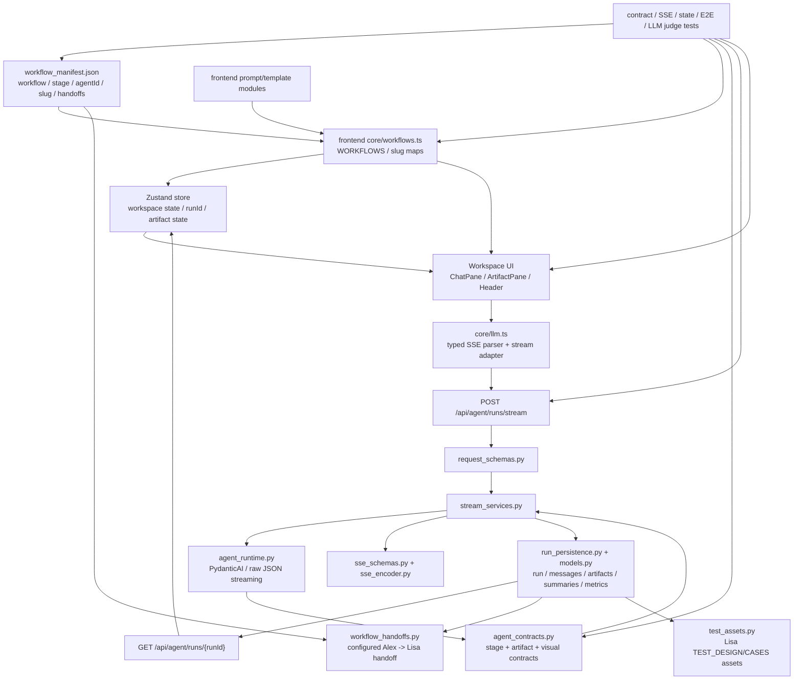

# New Agents 智能体重构扫描

## 状态

- 类型：第一轮只读扫描
- 范围：`tools/new-agents/` 及其相关文档、测试
- 当前状态：扫描完成
- 产出目标：形成重构前系统体检报告，为后续方案设计和 TDD 计划提供依据

## 扫描原则

- 只读扫描，不修改文件。
- 优先识别事实证据，再提出重构建议。
- 不把 Lisa、Alex 或单个 workflow 拆成独立 runtime、SSE/API、store 或 UI 渲染管线。
- 优先判断差异是否应该沉到配置、prompt/template、artifact contract 或 visualization contract。
- 所有重构建议必须包含可验证测试。

## 第一轮扫描提示词

```text
请扫描当前仓库的智能体模块。扫描过程只读，不修改任何代码、配置、测试或业务文档。

扫描完成后，请只更新以下文件的“扫描结果”章节，把完整扫描报告写入该文件：
docs/todos/refactor/2026-06-21-new-agents-refactor-scan.md

除这个扫描报告文件外，不要修改其他文件。

扫描范围优先级：
1. tools/new-agents/
2. docs/architecture.md
3. docs/api-contracts.md
4. docs/strategy/goal-mode-playbook.md
5. docs/plans/goal-mode-tech-debt-rules.md
6. tests/e2e/new_agents_browser/ 与 tools/new-agents/backend/tests/

请重点分析 tools/new-agents 当前架构是否适合一次全面重构，尤其关注：

一、现状图谱
- 前端 React/Zustand 工作流状态、页面、服务层、prompt/template、workflow 配置之间的关系
- 后端 Flask route、request schema、typed SSE、Agent Runtime、持久化、artifact contract、workflow manifest 之间的关系
- workflow_manifest.json、frontend WORKFLOWS、backend WORKFLOW_STAGES、artifact headings、Mermaid/structured visual contract 是否存在重复定义或同步风险
- Lisa、Alex、handoff、test assets、observability、Mermaid repair 等能力分别属于“通用智能体基础设施”还是“具体 workflow 能力”

二、架构风险
- 是否存在 agent-specific runtime branch、agent-specific API/SSE path、agent-specific store、agent-specific UI rendering pipeline
- 是否存在前后端 contract 重复、隐式耦合、字符串协议、硬编码 workflow/stage/agentId
- 是否存在 mock/fallback/fake success 掩盖真实错误
- 是否存在不符合“差异通过配置表达”的代码路径
- 哪些模块已经过大、职责不清、难以测试或难以扩展新 Agent

三、重构机会
请按风险和收益排序，列出 5-10 个候选重构方向。每个方向包含：
- 当前问题
- 影响文件
- 建议边界
- 是否保持现有 API/SSE 兼容
- 推荐验证测试
- 风险等级 P0/P1/P2
- 是否适合作为第一阶段重构

四、重构原则
请严格遵守：
- 不新增 agent-specific runtime、transport、state store、SSE/API path 或 bespoke rendering pipeline
- 新 workflow/agent 差异优先进入 workflow_manifest、prompt/template、artifact contract、visualization contract
- 保留 /api/agent/runs/stream typed Agent Runtime 主链路
- 无隐藏 fallback、无生产 mock、无 fake success
- 所有建议必须能被测试证明

最后输出：
1. 一张当前智能体模块架构图，用 Mermaid 表达
2. 一张“通用基础设施 vs workflow 配置/特化能力”的分层表
3. 最推荐的第一阶段重构范围
4. 不建议现在动的部分
5. 后续 TDD 实施计划草案

落盘要求：
- 将“当前状态”从“待执行扫描”更新为“扫描完成”。
- 将“扫描结果”下的待填充小节替换为实际内容。
- 保留本提示词，方便后续追溯扫描输入。
- 不要创建新的重构方案或实施计划文件；第二轮方案设计会另开文档。
```

## 扫描结果

本轮扫描完成于 2026-06-21。扫描过程只读，除本文档外未修改代码、配置、测试或业务文档。

### 1. 扫描范围

实际读取范围：

- 架构与规则文档：`docs/architecture.md`、`docs/api-contracts.md`、`docs/strategy/goal-mode-playbook.md`、`docs/plans/goal-mode-tech-debt-rules.md`。
- 共享 workflow 配置：`tools/new-agents/workflow_manifest.json`、`tools/new-agents/backend/workflow_manifest.py`、`tools/new-agents/frontend/src/core/workflows.ts`。
- 前端主链路：`frontend/src/store.ts`、`frontend/src/core/llm.ts`、`frontend/src/services/chatService.ts`、`frontend/src/pages/Workspace.tsx`、`frontend/src/core/config/*`、相关 service 和 component 测试。
- 后端主链路：`backend/routes.py`、`backend/request_schemas.py`、`backend/stream_services.py`、`backend/agent_runtime.py`、`backend/agent_contracts.py`、`backend/sse_schemas.py`、`backend/run_persistence.py`、`backend/context_builder.py`、`backend/models.py`。
- 特化能力：`backend/test_assets.py`、`backend/workflow_handoffs.py`、`frontend/src/pages/TestAssetsPage.tsx`、`frontend/src/services/testAssetService.ts`、`frontend/src/services/workflowHandoffService.ts`。
- 测试护栏：`backend/tests/test_workflow_contract_sync.py`、`backend/tests/test_backend_layering.py`、`backend/tests/test_agent_endpoint.py`、`frontend/src/core/config/__tests__/workflows.test.ts`、`tests/e2e/new_agents_browser/test_lisa_test_design_workflow.py`、`tests/e2e/new_agents_browser/test_alex_value_discovery_workflow.py`。

本轮未运行测试；这是文档扫描任务，验证限于文件读取、结构检查和 `git diff --check -- docs/todos`。

### 2. 当前架构概览

当前 `tools/new-agents/` 不是 Lisa/Alex 各自一套实现，而是单一 Agent Runtime 加配置化 workflow 的架构：



主要事实：

- 前端 `WORKFLOWS` 已从 `workflow_manifest.json` 读取基础元数据，但 prompt/template 仍通过 `STAGE_CONTENT` 显式映射，见 `tools/new-agents/frontend/src/core/workflows.ts:1` 和 `tools/new-agents/frontend/src/core/workflows.ts:41`。
- 后端 `WORKFLOW_STAGES`、artifact headings、Mermaid 和 `ai4se-visual` contract 仍集中在 `tools/new-agents/backend/agent_contracts.py:8`、`tools/new-agents/backend/agent_contracts.py:16`、`tools/new-agents/backend/agent_contracts.py:226`、`tools/new-agents/backend/agent_contracts.py:238`。
- 主运行链路统一走 `/api/agent/runs/stream`，路由层只注入默认 LLM 配置和 `AgentRunPersistence`，见 `tools/new-agents/backend/routes.py:113`。
- 服务端 run、message、artifact、context summary、metric、collaboration state 都已进入通用持久化模型，见 `tools/new-agents/backend/models.py` 与 `tools/new-agents/backend/run_persistence.py`。
- Lisa 测试资产是当前最明显的 workflow 特化能力：它显式绑定 `TEST_DESIGN/CASES`，见 `tools/new-agents/backend/test_assets.py:16` 和 `tools/new-agents/backend/test_assets.py:80`。

### 3. 核心运行链路

核心链路分为首轮生成、后续续写和恢复：

1. 用户在 `Workspace` 中进入 `/workspace/:agentId/:workflowSlug`，前端用 `SLUG_TO_WORKFLOW` 和 `WORKFLOWS[targetWorkflow].agentId` 校验 URL 与 agent 归属，见 `tools/new-agents/frontend/src/pages/Workspace.tsx:32`。
2. `ChatPane` 通过 `useChatService()` 调用 `generateResponseStream()`。`chatService.ts` 负责用户消息、生成状态、artifact rollback、错误提示和阶段确认编排。
3. `core/llm.ts` 构造 runtime 请求，解析 typed SSE 事件：`run_started`、`agent_delta`、`agent_turn`、`error`。它会拒绝旧 `<CHAT>/<ARTIFACT>/<CHART>` 标签协议，见 `tools/new-agents/frontend/src/core/llm.ts` 的 `LEGACY_PROTOCOL_TAG_PATTERN` 和 `parseAgentRuntimeEvent`。
4. 后端 `routes.py` 的 `/api/agent/runs/stream` 解析请求、检查默认 LLM 配置并返回 SSE，见 `tools/new-agents/backend/routes.py:113`。
5. `request_schemas.py` 使用 `WORKFLOW_STAGES` 校验 `workflowId/stageId`，拒绝未知 workflow 或 stage 不匹配。
6. `stream_services.py` 构造系统提示词并追加 artifact contract prompt，然后通过 `agent_runtime.py` 调用 PydanticAI 或 raw JSON streaming。
7. `agent_contracts.py` 校验 chat/artifact 分离、artifact 必需章节、Mermaid 类型和 `ai4se-visual` schema。失败会变成 typed `ErrorEvent`，不生成 fake success。
8. 成功时 `run_persistence.py` 记录 user/assistant message、当前阶段 artifact version、context summaries 和 turn metric；`run_started.runId` 返回服务端 runId。
9. 前端保存 `currentRunId`，后续同一工作区请求带回 runId；有服务端 run 时上下文由后端 `context_builder.py` 组装，而不是前端继续拼接完整历史。
10. `GET /api/agent/runs/{runId}` 支持 snapshot 恢复，前端 `restoreRunSnapshot()` 重建 workflow、stage、chat history、artifact history 和协作状态，见 `tools/new-agents/frontend/src/store.ts:863`。

该链路总体符合“共享 Runtime / typed SSE / 共享状态 / 共享 UI 基础设施”的高优先级原则。

### 4. 通用基础设施 vs Workflow 特化能力

| 层级 | 当前承载 | 归类 | 扫描判断 |
| --- | --- | --- | --- |
| Workflow 元数据 | `workflow_manifest.json`、`core/workflows.ts`、`workflow_manifest.py` | 通用基础设施 | 已共享，但还不是完整单一事实源。 |
| Prompt/template | `frontend/src/core/prompts/**`、`STAGE_CONTENT` | Workflow 配置 | 当前在 TS 模块中显式映射；适合继续配置化或生成化。 |
| Runtime API | `/api/agent/runs/stream`、`stream_services.py`、`agent_runtime.py` | 通用基础设施 | 保持单一路径，不应按 Agent 拆分。 |
| SSE 协议 | `sse_schemas.py`、`core/llm.ts` parser | 通用基础设施 | typed event 边界清晰；前后端 schema 仍是双实现。 |
| Artifact contract | `agent_contracts.py` | Workflow 契约配置 | 当前集中在 Python 常量；和 prompt/template 存在同步成本。 |
| Visual contract | Mermaid / `ai4se-visual` contract + `StructuredVisual` | 混合 | 渲染组件共享，契约仍后端主导，prompt 示例靠测试同步。 |
| Workspace state | `store.ts` | 通用基础设施 | 职责过宽，是重构风险最高的前端共享模块。 |
| Artifact 协作 | `ArtifactPane.tsx`、`run_persistence.py` collaboration state | 通用基础设施 | 业务价值通用，但 UI 文件已过大。 |
| Observability | `/api/agent/observability`、Header modal | 通用基础设施 | 按 workflow/stage/provider 聚合，适合保留共享层。 |
| Handoff | manifest `handoffs` + `workflow_handoffs.py` | 配置化跨 workflow 能力 | 目前是 Alex -> Lisa，但入口配置化；prompt 文案仍写死 Alex 语义。 |
| Lisa test assets | `test_assets.py`、`TestAssetsPage.tsx`、`testAssetService.ts` | Workflow 特化能力 | 可保留为 TEST_DESIGN 产物消费能力，但不应扩散到 Runtime。 |
| Mermaid repair | `/api/utils/mermaid/repair`、`mermaid_repair_service.py` | 通用工具能力 | 不绑定 Agent，适合保留共享工具端点。 |

### 5. 前后端契约与同步点

当前同步点包括：

- Manifest stage 顺序必须等于后端 `WORKFLOW_STAGES`。已有测试：`tools/new-agents/backend/tests/test_workflow_contract_sync.py:33`。
- Manifest stage key 必须等于 `REQUIRED_ARTIFACT_HEADINGS` key。已有测试：`tools/new-agents/backend/tests/test_workflow_contract_sync.py:37`。
- Handoff 必须引用已知 workflow/stage，且 `targetAgentId` 必须等于目标 workflow 的 `agentId`。已有测试：`tools/new-agents/backend/tests/test_workflow_contract_sync.py:64`。
- 前端 workflow card 从 `WORKFLOWS` 派生。已有测试：`tools/new-agents/frontend/src/core/config/__tests__/workflows.test.ts`。
- Prompt/template 必须包含后端 required structured visual 和 Mermaid 示例。已有测试在 `test_workflow_contract_sync.py` 中读取 prompt 文件硬编码映射，见 `tools/new-agents/backend/tests/test_workflow_contract_sync.py:96`。
- 前端 `core/llm.ts` 和后端 `sse_schemas.py` 分别实现 typed SSE event 校验；目前靠前后端测试保持一致，没有共享 schema 生成物。

主要同步风险：

- `workflow_manifest.json` 只承载元数据和 handoff，不承载 artifact headings、visual contract、prompt/template 文件路径和 schema prompt。
- `core/workflows.ts` 的 `STAGE_CONTENT` 仍按 workflow/stage 手写映射；新增 workflow 时，manifest、prompt import、STAGE_CONTENT、backend contract、tests 都要同步。
- `test_workflow_contract_sync.py` 的 prompt file map 本身也是一个同步清单；它能防漂移，但也是新增 workflow/stage 的维护点。
- 前端 TypeScript 的 SSE 类型和后端 Pydantic SSE schema 是双份定义，协议变化需要两边同时改。

### 6. 主要架构风险

| 风险 | 等级 | 证据 | 影响 |
| --- | --- | --- | --- |
| Workflow contract 多事实源 | P0 | manifest 在 JSON，prompt/template 在 TS import map，artifact/visual contract 在 Python 常量，prompt 示例测试另有文件映射。 | 新增或调整 workflow 容易漏同步，后续全面重构最容易引入漂移。 |
| 前端 `store.ts` 职责过宽 | P0 | 文件约 1001 行，包含持久化清洗、workflow 切换、artifact 协作、handoff、snapshot 恢复、视觉诊断、context summary 等。关键段落见 `tools/new-agents/frontend/src/store.ts:352`、`tools/new-agents/frontend/src/store.ts:821`、`tools/new-agents/frontend/src/store.ts:863`。 | 共享状态层难以演进，任何工作流能力都可能继续堆进同一 store。 |
| `ArtifactPane.tsx` 过大 | P1 | 文件约 6036 行，承载 artifact 预览、编辑、历史、协作、diff、merge、导出和诊断。 | UI 基础设施过载，后续冲突处理、导出或协作改动风险高。 |
| 后端 `run_persistence.py` / `test_assets.py` 过大 | P1 | `run_persistence.py` 约 1186 行，`test_assets.py` 约 1234 行。 | 持久化 repository 和特化资产逻辑边界过宽，测试虽多但维护成本高。 |
| Lisa test assets API 在 `routes.py` 中扩张 | P1 | `routes.py:276` 到 `routes.py:505` 是一组 Lisa 测试资产相关端点。 | 路由层已经混合通用 Runtime API 与 workflow 特化资产 API，后续更多 Agent 资产能力可能继续堆在同一 blueprint。 |
| Handoff prompt 文案仍写死 Alex 语义 | P1 | `workflow_handoffs.py` 使用 “请基于以下 Alex 产出的需求蓝图继续工作。” | 虽然 handoff 声明配置化，但 prompt 模板不是配置化，未来非 Alex/Lisa handoff 会出现专用分支压力。 |
| 默认 workflow 和旧 storage key 残留 Lisa 时代痕迹 | P2 | `DEFAULT_WORKFLOW = 'TEST_DESIGN'`、`OLD_KEY = 'lisa-storage'`，见 `tools/new-agents/frontend/src/store.ts:12` 和 `tools/new-agents/frontend/src/store.ts:408`。 | 不影响当前运行，但会强化“Lisa 是默认主路径”的隐性假设。 |
| 前后端 typed SSE schema 双实现 | P1 | 后端 `sse_schemas.py`、前端 `core/llm.ts` 分别校验同一事件协议。 | 协议演进时需要双改；缺少生成式 schema 会增加 drift 风险。 |
| 复杂错误归因分散 | P2 | provider 诊断在 `chatService.ts`，schema/runtime 错误在 `stream_services.py`，config issue 记录在 `routes.py`。 | 用户体验上已闭环，但治理规则分散，后续 provider/observability 扩展需谨慎。 |

未发现的问题：

- 未发现 Lisa/Alex 独立 Runtime、独立 SSE 主路径或独立 store。
- 未发现恢复旧 `/api/chat/stream` 文本协议的迹象。
- 生产代码未看到 `except Exception`、`@ts-ignore` 或 `as any` 这类明显禁止模式；测试中存在 mock 属于测试隔离。
- 当前错误路径多数显式返回 typed error 或 JSON error，没有用 fake success 掩盖主链路失败。

### 7. 候选重构方向

按风险和收益排序：

| 优先级 | 候选方向 | 当前问题 | 影响文件 | 建议边界 | API/SSE 兼容 | 推荐验证 | 是否适合第一阶段 |
| --- | --- | --- | --- | --- | --- | --- | --- |
| P0 | Contract registry 单一事实源设计 | workflow/stage/headings/visuals/prompt file map 分散 | `workflow_manifest.json`、`agent_contracts.py`、`core/workflows.ts`、`test_workflow_contract_sync.py` | 先设计 contract registry，不立刻迁移全部 prompt 文本 | 保持兼容 | manifest/contract sync tests、frontend workflow config tests、backend contract tests | 是 |
| P0 | 拆分 `store.ts` 的纯 reducer/selector/helpers | store 承担过多职责 | `store.ts`、`core/agentCore.ts`、store tests | 先抽纯函数和 slice helpers，不改变 Zustand 外部 API | 保持兼容 | `src/__tests__/store.test.ts`、`chatService.test.ts`、snapshot tests | 是 |
| P1 | 路由分组和特化 API blueprint 拆分 | `routes.py` 同时承载通用 Runtime 与 Lisa asset API | `routes.py`、`test_assets.py`、route tests | 分离 HTTP blueprint 文件，不改变 URL | 保持兼容 | backend endpoint tests、route blueprint tests | 可作为第二阶段 |
| P1 | Handoff prompt template 配置化 | handoff 声明配置化但 prompt 文案写死 Alex | `workflow_manifest.json`、`workflow_handoffs.py`、handoff tests | 在 manifest handoff 中加入 promptTemplate 或 template id | 保持兼容 | workflow handoff tests、E2E Alex->Lisa handoff | 可作为小切片 |
| P1 | 前后端 SSE schema 对齐机制 | TS/Pydantic 双定义 | `sse_schemas.py`、`core/llm.ts`、llm tests | 先增加协议 fixture 或 contract test，不急于引入代码生成 | 保持兼容 | backend SSE encoder tests、frontend llm parser tests | 适合作为安全护栏 |
| P1 | Lisa test assets 能力模块边界收敛 | workflow 特化能力较重，路由和服务命名全是 Lisa | `test_assets.py`、`TestAssetsPage.tsx`、`testAssetService.ts` | 保持 TEST_DESIGN 特化，但定义“artifact consumer”边界，避免 Runtime 分叉 | 保持兼容 | test_assets tests、Header/TestAssetsPage tests | 第二阶段 |
| P1 | ArtifactPane 分区拆分 | 6036 行 UI 文件过大 | `ArtifactPane.tsx` 及组件测试 | 按预览、历史、协作、导出、merge 操作拆组件/纯函数 | 保持兼容 | ArtifactPane tests、docx/pdf tests、visual diagnostics tests | 风险较高，先做计划 |
| P2 | 默认 workflow / legacy storage 清理 | Lisa 历史默认和旧 key 迁移逻辑残留 | `store.ts`、migration tests | 先记录策略，除非用户接受破坏旧 localStorage 迁移，否则保留 | 保持兼容或明确迁移 | store migration tests | 不建议第一阶段 |
| P2 | Observability/config error taxonomy 收敛 | 错误归因分布在前后端多个位置 | `stream_services.py`、`routes.py`、`chatService.ts`、observability tests | 先统一错误码说明和 test fixture | 保持兼容 | observability service/core tests、backend metric tests | 可后置 |

### 8. 推荐第一阶段重构范围

推荐第一阶段只做“共享契约收敛与护栏增强”，不要直接拆 UI 大文件或迁移 Runtime。

建议范围：

1. 建立 New Agents workflow contract registry 的设计和最小实现边界。
2. 明确哪些字段继续在 `workflow_manifest.json`，哪些仍留在 Python contract，哪些可通过 manifest 扩展或生成产物衔接。
3. 先补强同步测试，覆盖：
   - manifest workflow/stage/agentId/slug/listing；
   - backend `WORKFLOW_STAGES`；
   - required headings；
   - required Mermaid / structured visuals；
   - frontend prompt/template 映射；
   - handoff prompt template。
4. 如果进入实现，优先做小步迁移，例如把 handoff prompt template 或 visual contract metadata 的一部分移入 manifest，而不是一次性迁移所有 artifact headings。
5. 保持 `/api/agent/runs/stream`、SSE event shape、snapshot API、test assets API 完全兼容。

不建议第一阶段做：

- 拆 `ArtifactPane.tsx`。它风险高、测试面大，适合在 contract 护栏更稳定后单独做。
- 把所有 prompt/template 从 TS 迁移到 JSON。涉及打包、编辑体验、测试、类型和 prompt 维护方式，范围过大。
- 泛化 Lisa test assets 为多 Agent asset framework。当前只有一个成熟资产消费者，过早抽象容易制造空框架。

### 9. 暂不建议改动的区域

暂不建议在第一轮重构中改动：

- `/api/agent/runs/stream` 主链路、SSE event 名称和事件结构。
- PydanticAI / raw JSON streaming 的双路径实现，除非有明确生产问题。
- `AgentRun`、`AgentMessage`、`AgentArtifact`、`AgentArtifactVersion` 基础表结构。
- Lisa `TEST_DESIGN/CASES` 测试资产对 intent-tester 的当前手动接力边界。
- E2E LLM judge 的启用方式；它应保持显式环境变量控制。
- 已归档的 UX todo 历史记录；不应从历史“剩余”中直接捞新任务。

### 10. 测试与验证建议

后续若进入第二轮方案或第一阶段实现，建议验证层级如下：

- 契约同步最小集：
  - `.venv/bin/python -m pytest tools/new-agents/backend/tests/test_workflow_contract_sync.py`
  - `.venv/bin/python -m pytest tools/new-agents/backend/tests/test_agent_contracts.py`
  - `cd tools/new-agents/frontend && npm run test -- --run src/core/config/__tests__/workflows.test.ts src/core/__tests__/llm.test.ts`
- Runtime 主链路：
  - `.venv/bin/python -m pytest tools/new-agents/backend/tests/test_request_schemas.py tools/new-agents/backend/tests/test_sse_encoder.py tools/new-agents/backend/tests/test_stream_services.py tools/new-agents/backend/tests/test_agent_endpoint.py`
  - `cd tools/new-agents/frontend && npm run test -- --run src/services/__tests__/chatService.test.ts src/__tests__/store.test.ts`
- 特化能力：
  - `.venv/bin/python -m pytest tools/new-agents/backend/tests/test_test_assets.py tools/new-agents/backend/tests/test_workflow_handoffs.py`
  - `cd tools/new-agents/frontend && npm run test -- --run src/services/__tests__/testAssetService.test.ts src/services/__tests__/workflowHandoffService.test.ts src/pages/__tests__/TestAssetsPage.test.tsx`
- 浏览器主流程：
  - `.venv/bin/python -m pytest tests/e2e/new_agents_browser/test_lisa_test_design_workflow.py tests/e2e/new_agents_browser/test_alex_value_discovery_workflow.py`
  - 影响 prompt/artifact 质量时，再显式启用可选 LLM judge。
- 文档类变更：
  - `git diff --check -- docs/todos docs/strategy docs/api-contracts.md docs/architecture.md`

纯扫描阶段已执行的验证：

- `git diff --check -- docs/todos`

### 11. 开放问题

进入第二轮方案设计前建议确认：

- 是否希望 `workflow_manifest.json` 成为完整 contract 源，还是只作为 workflow 元数据源，后端 contract 继续由 Python 常量维护。
- 如果要提升配置化程度，prompt/template 是否接受从 TS 模块迁移到 JSON/Markdown 文件，还是继续保持 TS 常量并用生成/测试保持同步。
- Lisa test assets 是否仍定位为 `TEST_DESIGN/CASES` 的专属产物消费能力，还是希望长期演进为通用 artifact consumer framework。
- 是否接受先拆 `store.ts` 的纯逻辑 helper，但保持 Zustand API 不变。
- 是否需要为 typed SSE 引入共享 fixture 或 schema 生成，还是继续用前后端测试双向约束。
