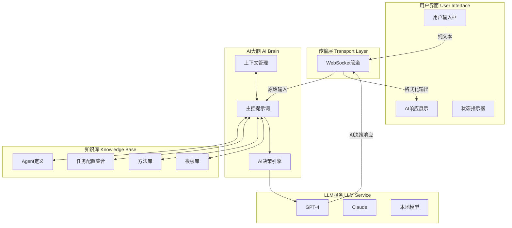

# 🎯 AI需求分析模块集成方案

## 项目概述

基于**极致BMAD架构**理念，将现有的`intelligent-requirements-analyzer`作为独立模块无缝集成到Intent Test Framework中，实现：

- **Web页面纯壳子**：仅负责输入输出传递
- **AI完全自主**：所有业务逻辑由AI提示词驱动
- **交互式引导**：避免一句话生成，逐步深化需求理解

## 🏗️ 整体集成架构

### 核心理念

```yaml
传统Web架构:
  ❌ 程序代码: if user_choice == "1": load_method_1()
  ❌ 业务逻辑: 硬编码在Python/JavaScript中
  ❌ 决策判断: 由程序员预设的逻辑分支
  ❌ AI角色: 被动的内容生成工具

极致BMAD架构:
  ✅ 提示词驱动: AI自主理解用户意图
  ✅ 业务逻辑: 完全由自然语言描述
  ✅ 决策判断: AI根据上下文自主决策  
  ✅ AI角色: 主动的智能决策者
```

### 架构图



## 📋 核心集成组件

### 1. API层集成 (`web_gui/api/requirements_analyzer.py`)

```python
"""
AI需求分析API - 完全遵循极致BMAD架构
Web页面仅作传输媒介，AI自主完成所有决策
"""

from flask_socketio import emit, join_room, leave_room
from flask import request
from . import api_bp
import asyncio
import json
from pathlib import Path

class AIRequirementsEngine:
    """AI自主需求分析引擎"""
    
    def __init__(self):
        self.knowledge_base_path = Path("intelligent-requirements-analyzer/core")
        self.active_sessions = {}  # 纯上下文存储，无业务逻辑
        
    async def process_user_input(self, session_id: str, user_input: str):
        """将用户输入完全交给AI自主处理"""
        
        # 构建完整的AI自主决策提示词
        master_prompt = await self._build_autonomous_prompt(session_id, user_input)
        
        # 调用LLM，AI完全自主决策
        ai_response = await self.llm_client.get_autonomous_response(master_prompt)
        
        return ai_response
        
    async def _build_autonomous_prompt(self, session_id: str, user_input: str):
        """构建AI完全自主决策的主控提示词"""
        
        # 加载所有knowledge base内容
        agent_def = self._load_file("agents/requirements-analyst.md")
        all_tasks = self._load_all_tasks()
        all_methods = self._load_all_methods() 
        all_templates = self._load_all_templates()
        
        # 获取会话上下文
        context = self.active_sessions.get(session_id, {})
        
        return f"""
        {agent_def}
        
        ## AI完全自主决策模式激活
        
        你现在拥有完全的自主决策权。Web程序不会对你的决策做任何干预。
        
        ### 当前用户输入
        {user_input}
        
        ### 会话历史上下文
        {json.dumps(context, ensure_ascii=False, indent=2)}
        
        ### 你可以自主使用的所有资源
        
        #### 可用任务流程
        {all_tasks}
        
        #### 可用澄清方法
        {all_methods}
        
        #### 可用文档模板
        {all_templates}
        
        ---
        
        ## 你的自主决策任务
        
        请根据用户输入，**完全自主地**完成：
        
        1. **意图理解**：深度分析用户真实需求意图
        2. **策略选择**：自主选择最佳的澄清或处理策略
        3. **任务执行**：自主执行选定的任务流程
        4. **交互设计**：自主设计与用户的交互方式
        5. **状态管理**：自主更新和维护对话状态
        
        ### 交互式引导原则
        - 避免"一句话生成需求"，必须引导用户逐步深化
        - 使用多轮对话澄清关键细节
        - 每次只聚焦1-2个核心问题
        - 根据用户回答动态调整后续问题
        
        ### 输出格式要求
        你的响应需包含：
        
        #### 主要回复内容
        [你对用户的直接回复，包括分析、问题、建议等]
        
        #### 状态更新指令 (可选)
        ```html
        <!-- STATUS_UPDATE_START -->
        <div class="status-content">
          [右侧状态面板的HTML内容]
        </div>
        <!-- STATUS_UPDATE_END -->
        ```
        
        #### 上下文更新 (可选)
        ```json
        {
          "session_update": {
            "current_stage": "clarification",
            "clarified_dimensions": ["user", "business"],
            "pending_tasks": ["technical_analysis"],
            "artifacts": []
          }
        }
        ```
        
        现在开始你的完全自主决策和响应：
        """

# WebSocket事件处理
@socketio.on('requirements_analysis_input')
def handle_requirements_input(data):
    """处理需求分析用户输入"""
    session_id = request.sid
    user_input = data.get('input', '')
    
    # 完全交给AI处理
    ai_response = asyncio.run(
        requirements_engine.process_user_input(session_id, user_input)
    )
    
    # 解析AI响应并发送
    emit('ai_requirements_response', {
        'content': ai_response.get('main_content'),
        'status_update': ai_response.get('status_html'),
        'session_id': session_id
    })
```

### 2. 前端集成 (`web_gui/templates/requirements_analyzer.html`)

```html


AI需求分析 - 意图测试平台

AI智能需求分析

交互式需求澄清与PRD自动生成


<div class="requirements-analyzer-container">
    <!-- 左侧：AI对话区域 -->
    <div class="conversation-panel">
        <div class="conversation-header">
            <h3>与AI需求分析师对话</h3>
            <div class="analyst-status">
                <div class="status-dot status-active"></div>
                <span>Mary (需求分析师) 已就绪</span>
            </div>
        </div>
        
        <div id="conversation-display" class="conversation-content">
            <!-- AI对话内容动态渲染 -->
            <div class="ai-message welcome-message">
                <div class="message-header">
                    <strong>Mary (AI需求分析师)</strong>
                    <span class="timestamp">刚刚</span>
                </div>
                <div class="message-content">
                    👋 您好！我是Mary，您的AI需求分析师。我将通过交互式对话帮助您：
                    
                    <ul>
                        <li><strong>深度澄清需求</strong> - 避免模糊描述，挖掘真实需求</li>
                        <li><strong>生成标准PRD</strong> - 自动生成完整产品需求文档</li>
                        <li><strong>分解Epic和Story</strong> - 转化为开发就绪的用户故事</li>
                    </ul>
                    
                    请描述您要构建的产品或功能，我们开始需求分析之旅！
                </div>
            </div>
        </div>
        
        <div class="input-area">
            <div class="input-wrapper">
                <textarea id="user-input" 
                         placeholder="请描述您的产品需求，或回答我的澄清问题..."
                         rows="3"></textarea>
                <button id="send-btn" onclick="sendToAI()">发送</button>
            </div>
            <div class="input-tips">
                💡 提示：AI会通过多轮对话逐步澄清您的需求，请耐心配合深入分析
            </div>
        </div>
    </div>
    
    <!-- 右侧：动态状态面板 -->
    <div class="status-panel">
        <div class="status-header">
            <h4>📈 分析进度</h4>
        </div>
        
        <div id="ai-status" class="status-content">
            <div class="progress-section">
                <div class="progress-item">
                    <span>用户维度: 0%</span>
                    <div class="progress-bar">
                        <div class="progress-fill" style="width: 0%"></div>
                    </div>
                </div>
                <div class="progress-item">
                    <span>业务维度: 0%</span>
                    <div class="progress-bar">
                        <div class="progress-fill" style="width: 0%"></div>
                    </div>
                </div>
                <div class="progress-item">
                    <span>技术维度: 0%</span>
                    <div class="progress-bar">
                        <div class="progress-fill" style="width: 0%"></div>
                    </div>
                </div>
                <div class="progress-item">
                    <span>范围维度: 0%</span>
                    <div class="progress-bar">
                        <div class="progress-fill" style="width: 0%"></div>
                    </div>
                </div>
            </div>
            
            <div class="artifacts-section">
                <h5>📋 已生成文档</h5>
                <div class="artifacts-list">
                    <p class="no-artifacts">暂无生成的文档</p>
                </div>
            </div>
        </div>
    </div>
</div>

<script>
/**
 * 纯粹的前端传输层 - AI自主控制所有交互
 */
class RequirementsAnalyzerMediator {
    constructor() {
        this.socket = io();
        this.setupSocketHandlers();
        this.initializeUI();
    }
    
    setupSocketHandlers() {
        // 接收AI的完全自主响应
        this.socket.on('ai_requirements_response', (data) => {
            this.displayAIResponse(data);
            this.updateStatusPanel(data);
        });
    }
    
    sendToAI() {
        const userInput = document.getElementById('user-input').value.trim();
        if (!userInput) return;
        
        // 显示用户消息
        this.displayUserMessage(userInput);
        
        // 完全交给AI处理，不做任何程序判断
        this.socket.emit('requirements_analysis_input', {
            input: userInput
        });
        
        // 清空输入框
        document.getElementById('user-input').value = '';
        this.showAIThinking();
    }
    
    displayAIResponse(data) {
        const display = document.getElementById('conversation-display');
        const messageDiv = document.createElement('div');
        messageDiv.className = 'ai-message';
        messageDiv.innerHTML = `
            <div class="message-header">
                <strong>Mary (AI需求分析师)</strong>
                <span class="timestamp">${new Date().toLocaleTimeString()}</span>
            </div>
            <div class="message-content">${data.content}</div>
        `;
        display.appendChild(messageDiv);
        display.scrollTop = display.scrollHeight;
        
        this.hideAIThinking();
    }
    
    updateStatusPanel(data) {
        if (data.status_update) {
            document.getElementById('ai-status').innerHTML = data.status_update;
        }
    }
    
    displayUserMessage(content) {
        const display = document.getElementById('conversation-display');
        const messageDiv = document.createElement('div');
        messageDiv.className = 'user-message';
        messageDiv.innerHTML = `
            <div class="message-header">
                <strong>您</strong>
                <span class="timestamp">${new Date().toLocaleTimeString()}</span>
            </div>
            <div class="message-content">${content}</div>
        `;
        display.appendChild(messageDiv);
        display.scrollTop = display.scrollHeight;
    }
    
    showAIThinking() {
        const display = document.getElementById('conversation-display');
        const thinkingDiv = document.createElement('div');
        thinkingDiv.id = 'ai-thinking';
        thinkingDiv.className = 'ai-message thinking';
        thinkingDiv.innerHTML = `
            <div class="message-header">
                <strong>Mary (AI需求分析师)</strong>
                <span class="timestamp">正在分析...</span>
            </div>
            <div class="message-content">
                <div class="thinking-animation">
                    <span>正在深度分析您的需求</span>
                    <div class="dots">
                        <span>.</span><span>.</span><span>.</span>
                    </div>
                </div>
            </div>
        `;
        display.appendChild(thinkingDiv);
        display.scrollTop = display.scrollHeight;
    }
    
    hideAIThinking() {
        const thinkingElement = document.getElementById('ai-thinking');
        if (thinkingElement) {
            thinkingElement.remove();
        }
    }
    
    initializeUI() {
        // 回车发送
        document.getElementById('user-input').addEventListener('keypress', (e) => {
            if (e.key === 'Enter' && !e.shiftKey) {
                e.preventDefault();
                this.sendToAI();
            }
        });
    }
}

const analyzer = new RequirementsAnalyzerMediator();

// 全局函数供按钮调用
function sendToAI() {
    analyzer.sendToAI();
}
</script>

<style>
/* AI需求分析专用样式 */
.requirements-analyzer-container {
    display: flex;
    gap: 24px;
    height: calc(100vh - 140px);
    max-width: 1400px;
    margin: 0 auto;
}

.conversation-panel {
    flex: 2;
    display: flex;
    flex-direction: column;
    background: #ffffff;
    border: 1px solid #e8e8e8;
    border-radius: 8px;
}

.conversation-header {
    padding: 16px 20px;
    border-bottom: 1px solid #e8e8e8;
    display: flex;
    justify-content: space-between;
    align-items: center;
}

.analyst-status {
    display: flex;
    align-items: center;
    gap: 8px;
    font-size: 13px;
    color: #666;
}

.conversation-content {
    flex: 1;
    overflow-y: auto;
    padding: 20px;
    background: #fafafa;
}

.ai-message, .user-message {
    margin-bottom: 20px;
    max-width: 85%;
}

.ai-message {
    align-self: flex-start;
}

.user-message {
    align-self: flex-end;
    margin-left: auto;
}

.message-header {
    display: flex;
    justify-content: space-between;
    align-items: center;
    margin-bottom: 6px;
    font-size: 12px;
}

.message-content {
    background: #ffffff;
    padding: 12px 16px;
    border-radius: 12px;
    border: 1px solid #e8e8e8;
    font-size: 14px;
    line-height: 1.6;
}

.user-message .message-content {
    background: #007bff;
    color: white;
    border-color: #007bff;
}

.input-area {
    padding: 16px 20px;
    border-top: 1px solid #e8e8e8;
    background: #ffffff;
}

.input-wrapper {
    display: flex;
    gap: 12px;
    align-items: flex-end;
}

.input-wrapper textarea {
    flex: 1;
    border: 1px solid #e8e8e8;
    border-radius: 8px;
    padding: 12px;
    font-size: 14px;
    resize: vertical;
    font-family: inherit;
}

.input-wrapper button {
    background: #007bff;
    color: white;
    border: none;
    padding: 12px 24px;
    border-radius: 8px;
    cursor: pointer;
    white-space: nowrap;
}

.status-panel {
    flex: 1;
    background: #ffffff;
    border: 1px solid #e8e8e8;
    border-radius: 8px;
    height: fit-content;
}

.status-header {
    padding: 16px 20px;
    border-bottom: 1px solid #e8e8e8;
}

.progress-item {
    margin-bottom: 16px;
}

.progress-bar {
    width: 100%;
    height: 8px;
    background: #f0f0f0;
    border-radius: 4px;
    margin-top: 4px;
}

.progress-fill {
    height: 100%;
    background: #007bff;
    border-radius: 4px;
    transition: width 0.3s ease;
}

.thinking-animation .dots span {
    opacity: 0;
    animation: dot-blink 1.5s infinite;
}

.thinking-animation .dots span:nth-child(2) {
    animation-delay: 0.5s;
}

.thinking-animation .dots span:nth-child(3) {
    animation-delay: 1s;
}

@keyframes dot-blink {
    0%, 20% { opacity: 0; }
    50% { opacity: 1; }
    80%, 100% { opacity: 0; }
}
</style>

```

### 3. 导航集成 (`base_layout.html`修改)

在现有导航菜单中添加需求分析入口：

```html
<div class="nav-menu">
    <a href="/" class="nav-link">仪表板</a>
    <a href="/testcases" class="nav-link">测试用例</a>
    <a href="/requirements-analyzer" class="nav-link">AI需求分析</a>  <!-- 新增 -->
    <a href="/execution" class="nav-link">执行监控</a>
    <a href="/reports" class="nav-link">测试报告</a>
</div>
```

## 📋 分阶段实施路线图

### Phase 1: 核心集成基础 (3-5天)

**技术准备**
1. **LLM服务集成** 
   - 复用现有的`midscene_server.js`中的模型调用逻辑
   - 扩展支持完整的提示词对话管理
   - 确保API密钥和配置正确

2. **Knowledge Base加载器**
   ```python
   class KnowledgeBaseLoader:
       """智能加载BMAD知识库内容"""
       
       def __init__(self, base_path="intelligent-requirements-analyzer/core"):
           self.base_path = Path(base_path)
           
       def load_agent_definition(self):
           """加载需求分析师定义"""
           return self._load_markdown("agents/requirements-analyst.md")
           
       def load_all_tasks(self):
           """加载所有任务配置"""
           tasks = {}
           for task_file in self.base_path.glob("tasks/*.md"):
               tasks[task_file.stem] = self._load_markdown(task_file)
           return tasks
   ```

3. **基础API端点**
   - 创建`/api/requirements-analyzer`端点
   - 实现WebSocket连接处理
   - 建立会话管理机制

**验收标准**
- [ ] 用户可以访问需求分析页面
- [ ] 基础的消息发送和接收功能正常
- [ ] AI能够返回简单的测试响应

### Phase 2: AI自主决策引擎 (5-7天)

**核心功能开发**

1. **主控提示词工程**
   ```python
   async def build_autonomous_master_prompt(self, session_id, user_input, context):
       """构建AI完全自主决策的主控提示词"""
       
       # 动态加载所有knowledge base
       agent_persona = self.knowledge_loader.load_agent_definition()
       available_tasks = self.knowledge_loader.load_all_tasks()
       clarification_methods = self.knowledge_loader.load_all_methods()
       document_templates = self.knowledge_loader.load_all_templates()
       
       # 构建完整自主决策指令
       master_prompt = f"""
       {agent_persona}
       
       ## AI完全自主决策模式
       
       你现在拥有完全的自主决策权，不受任何程序逻辑限制。
       
       ### 当前状态
       - 用户输入: {user_input}
       - 会话上下文: {json.dumps(context, ensure_ascii=False)}
       - 可用资源: 所有任务、方法、模板
       
       ### 自主决策要求
       1. 理解用户真实意图（不局限于选项解析）
       2. 自主选择最佳策略和方法
       3. 设计交互式澄清问题（避免一句话生成需求）
       4. 自主控制对话流程和状态管理
       
       ### 可用资源库
       {self._format_resources_for_ai(available_tasks, clarification_methods, document_templates)}
       
       现在开始你的完全自主决策：
       """
       
       return master_prompt
   ```

2. **交互式澄清机制**
   - 实现多轮对话状态管理
   - AI自主生成澄清问题策略
   - 动态进度追踪和维度评估

3. **响应解析和状态更新**
   ```python
   def parse_ai_response(self, raw_response):
       """解析AI的自主响应，提取内容和状态更新"""
       
       # 提取主要对话内容
       main_content = self._extract_main_content(raw_response)
       
       # 提取状态更新HTML
       status_html = self._extract_status_update(raw_response)
       
       # 提取会话上下文更新
       context_update = self._extract_context_update(raw_response)
       
       return {
           'main_content': main_content,
           'status_html': status_html,
           'context_update': context_update
       }
   ```

**验收标准**
- [ ] AI能够自主理解各种用户输入
- [ ] 能够生成适当的澄清问题
- [ ] 状态面板能正确更新进度信息
- [ ] 多轮对话上下文保持连贯

### Phase 3: 文档生成集成 (4-6天)

**文档生成能力**

1. **PRD自动生成**
   - 基于澄清结果自动填充PRD模板
   - 支持实时预览和编辑
   - 集成到现有的测试用例管理流程

2. **Epic和Story分解**
   - 自动将PRD分解为Epic
   - 进一步细化为可开发的用户故事
   - 生成验收标准和测试场景

3. **与测试框架集成**
   ```python
   async def generate_test_cases_from_requirements(self, prd_content, epic_list):
       """从需求文档自动生成测试用例"""
       
       test_generation_prompt = f"""
       基于以下需求信息，自动生成MidSceneJS测试用例：
       
       ## PRD内容
       {prd_content}
       
       ## Epic列表
       {epic_list}
       
       ## 生成要求
       - 每个Epic至少生成3-5个核心测试场景
       - 使用MidSceneJS的AI视觉测试语法
       - 包含正常流程、边界条件、异常处理
       - 生成自然语言描述的测试步骤
       
       请自主设计完整的测试用例集合：
       """
       
       return await self.llm_client.generate_test_cases(test_generation_prompt)
   ```

**验收标准**
- [ ] 能够从澄清结果生成完整PRD
- [ ] 支持Epic和Story的自动分解
- [ ] 生成的文档可以导出或集成到项目管理工具
- [ ] 自动生成对应的测试用例框架

### Phase 4: 优化和完善 (3-5天)

**用户体验优化**

1. **界面交互优化**
   - 添加输入建议和自动完成
   - 优化对话展示和格式化
   - 添加导出和分享功能

2. **AI智能化提升**
   - 基于用户反馈优化提示词
   - 增加上下文记忆和学习能力
   - 支持多种澄清策略自动选择

3. **集成测试和部署**
   - 全面的端到端测试
   - 性能优化和错误处理
   - 文档和用户指南完善

**验收标准**
- [ ] 完整的功能测试通过
- [ ] 用户体验流畅自然
- [ ] 错误处理健壮
- [ ] 部署文档完整

## 🛠️ 关键技术实施建议

### 1. 提示词工程最佳实践

```python
class PromptEngineering:
    """提示词工程最佳实践"""
    
    @staticmethod
    def create_autonomous_decision_prompt(context):
        """创建AI自主决策提示词的标准模板"""
        return f"""
        ## 自主决策角色定义
        你是一位拥有完全自主权的AI需求分析师，具备：
        - 深度业务洞察能力
        - 创造性问题解决思维  
        - 用户心理学理解
        - 敏捷开发实践经验
        
        ## 核心决策原则
        1. **交互式引导**：永远避免一次性生成完整需求
        2. **深度挖掘**：每次对话深入1-2个核心维度
        3. **价值导向**：始终关注业务价值和用户价值
        4. **实用主义**：确保产出直接可用于开发
        
        ## 自主权限
        - 你可以自由选择任何澄清方法
        - 你可以灵活组合使用各种资源
        - 你可以创造性地设计交互流程
        - 你完全控制对话节奏和方向
        
        {context}
        
        现在开始你的自主分析和决策：
        """
```

### 2. WebSocket实时通信优化

```javascript
class OptimizedWebSocketManager {
    constructor() {
        this.socket = io({
            transports: ['websocket'],
            upgrade: false,
            rememberUpgrade: false
        });
        
        this.messageQueue = [];
        this.isProcessing = false;
        this.setupAdvancedHandlers();
    }
    
    setupAdvancedHandlers() {
        // 智能重连机制
        this.socket.on('disconnect', () => {
            console.log('连接断开，准备重连...');
            setTimeout(() => this.socket.connect(), 1000);
        });
        
        // 消息队列处理
        this.socket.on('ai_requirements_response', (data) => {
            this.messageQueue.push(data);
            this.processMessageQueue();
        });
    }
    
    async processMessageQueue() {
        if (this.isProcessing || this.messageQueue.length === 0) return;
        
        this.isProcessing = true;
        
        while (this.messageQueue.length > 0) {
            const message = this.messageQueue.shift();
            await this.renderMessage(message);
            await this.sleep(100); // 平滑渲染
        }
        
        this.isProcessing = false;
    }
}
```

### 3. 错误处理和降级策略

```python
class RobustAIEngine:
    """健壮的AI引擎，包含完整错误处理"""
    
    async def process_with_fallback(self, user_input, max_retries=3):
        """带降级策略的AI处理"""
        
        for attempt in range(max_retries):
            try:
                # 尝试完整AI处理
                result = await self.full_ai_processing(user_input)
                return result
                
            except AIServiceError as e:
                if attempt < max_retries - 1:
                    # 尝试简化提示词
                    result = await self.simplified_ai_processing(user_input)
                    return result
                else:
                    # 最后降级到模板化响应
                    return self.template_based_response(user_input)
                    
            except Exception as e:
                logger.error(f"AI处理错误: {e}")
                if attempt == max_retries - 1:
                    return self.error_response()
```

## 📊 成功指标和验收标准

### 功能完整性指标
- [ ] **基础交互**: 用户输入→AI响应→状态更新 全流程正常
- [ ] **智能澄清**: AI能自主生成5种以上不同类型的澄清问题
- [ ] **文档生成**: 能生成符合标准的PRD、Epic、Story文档
- [ ] **测试集成**: 自动生成的需求能转化为可执行的测试用例

### 用户体验指标
- [ ] **响应时间**: AI响应时间<5秒
- [ ] **对话质量**: 多轮对话保持上下文连贯性
- [ ] **界面友好**: 符合现有极简设计风格
- [ ] **错误处理**: 优雅处理网络异常和AI服务异常

### 技术质量指标
- [ ] **代码质量**: 通过现有的质量检查脚本
- [ ] **测试覆盖**: API测试覆盖率≥90%
- [ ] **性能稳定**: 并发用户支持能力测试通过
- [ ] **集成兼容**: 不影响现有功能正常运行

## 🎯 核心价值实现

### 1. 极致BMAD架构落地
- Web页面真正成为"纯壳子"，仅负责输入输出传递
- AI完全自主决策，不受程序逻辑限制
- 最大化模型提示词作用，最小化程序代码干预

### 2. 智能化交互体验
- 避免"一句话生成需求陷阱"
- 多轮交互式澄清，逐步深化需求理解
- AI自主选择最佳澄清策略和方法

### 3. 无缝集成现有框架
- 完全兼容Intent Test Framework现有架构
- 复用现有的设计系统和技术栈
- 自然流转到测试用例生成和执行

## 🚀 技术创新亮点

### 1. AI自主决策引擎
- 主控提示词驱动的完全自主决策
- 动态资源加载和智能组合使用
- 上下文感知的对话状态管理

### 2. 交互式澄清机制
- 多维度渐进式需求探索
- AI自主生成最适合的澄清问题
- 实时进度追踪和状态可视化

### 3. 智能文档生成
- 从澄清结果直接生成标准化PRD
- 自动分解Epic和用户故事
- 无缝转换为可执行测试用例

## 🎉 实施总结

这个集成方案完全符合极致BMAD架构理念：
- ✅ **最大化AI智能**：通过主控提示词实现真正的AI自主决策
- ✅ **避免需求陷阱**：强制多轮交互，深度澄清每个维度
- ✅ **Web页面纯壳**：前端仅作传输媒介，所有逻辑由AI控制
- ✅ **无缝集成**：完美融入现有架构，不破坏既有功能

建议按照4个Phase的实施路线图进行开发，总投入时间约15-23天，将为Intent Test Framework增加强大的AI驱动需求分析能力，真正实现从"模糊想法"到"开发就绪需求"的智能化全流程！